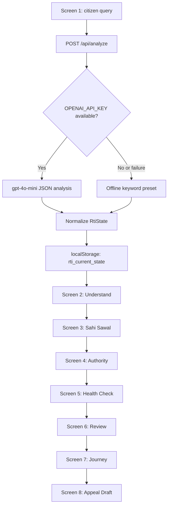

# RTI Saarthi Project Review

## 1. System Overview

RTI Saarthi is a Next.js App Router application that helps citizens turn plain-language public-service questions into structured, record-focused RTI requests.

The application has three core responsibilities:

1. Accept a citizen's natural-language question.
2. Analyze it into a domain, goal, records request, public authority, route guard, and deterministic health metadata.
3. Guide the citizen through an eight-screen flow before producing a mock submission and first-appeal draft.

The product deliberately separates information access from grievance resolution:

- RTI requests existing records and information.
- Grievance channels request action, such as releasing a delayed payment or repairing infrastructure.
- The UI warns citizens not to attach sensitive identity documents such as Aadhaar or PAN numbers.
- The submission journey is explicitly synthetic. No real RTI filing or payment occurs.

### Technology

- Next.js `16.3.3`
- React `19.2.8`
- TypeScript with strict checking
- Tailwind CSS v4
- `lucide-react` for interface icons
- OpenAI SDK for optional server-side analysis
- Browser `localStorage` for the current request state

### Repository Layout

```text
app/                         Active route adapters for the repository
src/app/                     Primary App Router implementations
src/app/api/analyze/         Universal POST analysis endpoint
src/components/              Shared GovernmentBanner and FaqAssistant
src/context/                 LanguageContext and translation dictionaries
src/lib/types.ts             Universal RTI state and demo data
src/lib/client-state.ts      Safe localStorage reader
public/                      Static assets
```

The repository contains a root `app/` tree with thin adapters that re-export implementations from `src/app/`. This is necessary because Next resolves the existing root `app/` directory as the active App Router tree.

## 2. End-to-End Architecture



### State Transport

Screen 1 sends only the current query to the server:

```ts
body: JSON.stringify({ query: question.trim() })
```

The returned normalized object is saved under:

```ts
localStorage.setItem("rti_current_state", JSON.stringify(data));
```

Downstream client screens call `readRtiState()` after mounting. The helper merges stored values with `defaultUniversalState`, which protects the UI if storage is empty, malformed, or missing fields.

```ts
export function readRtiState(): RtiState {
  if (typeof window === "undefined") return defaultUniversalState;

  try {
    const stored = window.localStorage.getItem("rti_current_state");
    return stored ? { ...defaultUniversalState, ...JSON.parse(stored) } : defaultUniversalState;
  } catch {
    return defaultUniversalState;
  }
}
```

## 3. Screen Flow: Screens 1 to 8

### Screen 1: Ask a Question (`/`)

File: `src/app/page.tsx`

Purpose:

- Presents the universal RTI entry point.
- Validates the query locally before analysis.
- Supports four translated sample query chips.
- Calls `/api/analyze`.
- Shows an analyzing state on the Continue button.
- Saves the returned state and navigates to `/understand`.

The local validation is intentionally lightweight and deterministic. It requires a query of at least 12 characters and a public-records topic such as pension, road, tender, scholarship, water, report, order, or status.

Visible content is sourced from `useLanguage()` for the translated badge, hero, subtitle, input label, placeholder, buttons, validation messages, preview labels, and sample chips.

### Screen 2: Understand the Goal (`/understand`)

File: `src/app/understand/page.tsx`

Purpose:

- Displays the saved citizen query.
- Shows the analyzed `state.goal`.
- Shows the RTI suitability explanation.
- Offers two paths:
  - Information path to `/question`.
  - Grievance path to the configured external grievance portal.

This is the route guard that explains what RTI can discover and what it cannot directly resolve.

### Screen 3: Sahi Sawal (`/question`)

File: `src/app/question/page.tsx`

Purpose:

- Presents `state.restructuredRequests` as numbered record requests.
- Allows the citizen to edit the request rows locally.
- Sends the citizen to `/authority` after confirming the records.

The requests are not generated in the component. They come from the persisted analyzer response, allowing infrastructure, scholarship, pension, civic, and general questions to follow the same UI.

### Screen 4: Authority Match (`/authority`)

File: `src/app/authority/page.tsx`

Purpose:

- Displays `state.suggestedAuthority`.
- Displays `state.authorityConfidence`.
- Displays `state.authorityReason`.
- Continues to `/health-check`.

The screen is client-rendered so it can hydrate from the browser's current request state.

### Screen 5: Deterministic Health Check (`/health-check`)

File: `src/app/health-check/page.tsx`

Purpose:

- Shows the analyzed health score.
- Displays authority, request type, specificity, privacy, and character checks.
- Shows the privacy reminder not to upload Aadhaar or PAN.
- Shows the jurisdiction shield.
- Continues to `/review`.

Dynamic values include:

- `state.healthScore`
- `state.jurisdiction`
- `state.privacyGuard`
- `state.characterCount`

### Screen 6: Review and Mock Submission (`/review`)

File: `src/app/review/page.tsx`

Purpose:

- Lists the persisted record requests.
- Shows the application fee as INR 10.
- Clearly labels the flow as mock-only.
- Simulates a short submission delay.
- Reveals `state.registrationNumber` after submission.
- Navigates to `/journey`.

No external filing or payment API is called from this screen.

### Screen 7: Track the Journey (`/journey`)

File: `src/app/journey/page.tsx`

Purpose:

- Displays the synthetic registration number.
- Shows a submitted-for-information status.
- Identifies the current analyzed domain.
- Continues to `/appeal`.

### Screen 8: First Appeal Guidance (`/appeal`)

File: `src/app/appeal/page.tsx`

Purpose:

- Builds a first-appeal draft from the current state.
- Includes the citizen query.
- Names the matched authority.
- Lists every requested record.
- Retains the synthetic registration number.
- Returns the citizen to `/` to start another question.

The draft is generated in the client from the current `RtiState`, so it changes automatically when a different query is analyzed.

## 4. Universal State Model

File: `src/lib/types.ts`

The principal state contract is `RtiState`:

```ts
export type RequestDomain =
  | "infrastructure"
  | "pension"
  | "scholarship"
  | "civic"
  | "general";

export interface RtiState {
  question: string;
  domain: RequestDomain;
  goal: string;
  suggestedAuthority: string;
  authorityReason: string;
  citizenGoal: string;
  suitabilityReason: string;
  restructuredRequests: string[];
  publicAuthority: string;
  jurisdiction: "Central" | "State" | "Municipal";
  authorityConfidence: number;
  betterGrievanceRoute: string;
  grievanceUrl: string;
  healthScore: number;
  characterCount: number;
  privacyGuard: string;
  pensionData: PensionRecord[];
  registrationNumber: string;
  validation: {
    isValid: boolean;
    label: string;
    detail: string;
  };
}
```

`goal`, `suggestedAuthority`, and `authorityReason` are the current field names used by Screens 2, 4, and 8. The older `citizenGoal`, `publicAuthority`, and `suitabilityReason` fields remain for compatibility with earlier screens and analyzer responses.

### Offline Demo State

`defaultUniversalState` represents an infrastructure query about Ward 4 road repair. It supplies a complete usable state when no analysis has been saved or the API is offline.

The state contains:

- Infrastructure domain
- Ward 4 road repair goal
- Municipal authority
- 94% authority confidence
- Five tender, measurement-book, inspection, contractor, and file-note requests
- Deterministic health score
- Mock registration number

## 5. Universal Analyze API

File: `src/app/api/analyze/route.ts`

The endpoint accepts a JSON POST body:

```ts
{ "query": "Road repair tender status in Ward 4" }
```

It returns an `RtiState` JSON object.

### Route Behavior

1. Parse the request body.
2. If the query is empty or `OPENAI_API_KEY` is absent, use `offlineState(query)`.
3. If an API key exists, call `gpt-4o-mini` with JSON response mode.
4. Parse the model response.
5. Normalize domain, jurisdiction, request count, confidence, health score, and character count.
6. If the network call, JSON parse, or model call fails, return the deterministic offline preset.

### OpenAI Request Excerpt

```ts
const completion = await client.chat.completions.create({
  model: "gpt-4o-mini",
  response_format: { type: "json_object" },
  messages: [
    {
      role: "system",
      content:
        "You are a careful Indian RTI request analyzer. Return only JSON matching the requested schema. RTI under Section 2(f) seeks existing records, not explanations, action, or opinions.",
    },
    {
      role: "user",
      content: `Analyze this citizen query: ${query}`,
    },
  ],
});
```

### Offline Classification

The offline classifier checks keywords in priority order:

- Pension: `pension`, `gratuity`, `epfo`, `credited`
- Scholarship: `scholarship`, `merit`, `stipend`, `disbursement`
- Infrastructure: `road`, `ward`, `pothole`, `tender`, `contractor`
- Default civic: all other queries

Each preset supplies its own goal, record requests, authority, confidence, jurisdiction, grievance route, and URL. This prevents every offline question from incorrectly becoming the Ward 4 infrastructure demo.

### Normalization Excerpt

```ts
function normalizeResult(query: string, result: Partial<RtiState>): RtiState {
  const fallback = offlineState(query);
  const domains: RequestDomain[] = [
    "infrastructure",
    "pension",
    "scholarship",
    "civic",
    "general",
  ];

  return {
    ...fallback,
    ...result,
    question: query.trim(),
    domain: domains.includes(result.domain as RequestDomain)
      ? result.domain as RequestDomain
      : fallback.domain,
    restructuredRequests:
      Array.isArray(result.restructuredRequests) &&
      result.restructuredRequests.length >= 4
        ? result.restructuredRequests.slice(0, 5).map(String)
        : fallback.restructuredRequests,
    characterCount: query.length,
  };
}
```

## 6. Screen 1 Code Excerpt

File: `src/app/page.tsx`

```tsx
"use client";

import { useState } from "react";
import { useRouter } from "next/navigation";
import { useLanguage } from "@/context/LanguageContext";

const sampleQuestionKeys = [
  "sample_chip_road",
  "sample_chip_pension",
  "sample_chip_scholarship",
  "sample_chip_water",
] as const;

export default function Home() {
  const [question, setQuestion] = useState("");
  const [isAnalyzing, setIsAnalyzing] = useState(false);
  const validation = validateQuestion(question);
  const router = useRouter();
  const { t } = useLanguage();

  async function continueToUnderstand() {
    if (!validation.isValid || isAnalyzing) return;
    setIsAnalyzing(true);

    try {
      const response = await fetch("/api/analyze", {
        method: "POST",
        headers: { "Content-Type": "application/json" },
        body: JSON.stringify({ query: question.trim() }),
      });
      const data = await response.json();
      localStorage.setItem("rti_current_state", JSON.stringify(data));
      router.push("/understand");
    } finally {
      setIsAnalyzing(false);
    }
  }
}
```

The input and translated chip behavior is:

```tsx
<textarea
  value={question}
  onChange={(event) => setQuestion(event.target.value)}
  placeholder={t("placeholder")}
/>

{sampleQuestionKeys.map((sampleQuestionKey) => (
  <button
    key={sampleQuestionKey}
    type="button"
    onClick={() => setQuestion(t(sampleQuestionKey))}
  >
    {t(sampleQuestionKey)}
  </button>
))}
```

## 7. Translation Architecture

File: `src/context/LanguageContext.tsx`

Supported language codes:

```ts
export type LanguageCode =
  | "en"
  | "hi"
  | "bn"
  | "te"
  | "mr"
  | "ta"
  | "gu"
  | "kn"
  | "ml"
  | "pa";
```

The dictionary uses a strict key contract:

```ts
export type TranslationKey =
  | "portal_title"
  | "brand_title"
  | "header_subtitle"
  | "checks_enabled"
  | "about"
  | "live_alert_badge"
  | "live_alert"
  | "screen_1_badge"
  | "hero_title"
  | "hero_sub"
  | "input_label"
  | "placeholder"
  | "btn_continue"
  | "btn_analyze"
  | "need_more_detail"
  | "question_clear"
  | "validation_clear_detail"
  | "recent_inquiries"
  | "clarity_card"
  | "faq_desk_btn"
  | "try_sample"
  | "sample_chip_road"
  | "sample_chip_pension"
  | "sample_chip_scholarship"
  | "sample_chip_water"
  | "your_records"
  | "records_count"
  | "item_road_title"
  | "item_road_dept"
  | "item_scholarship_title"
  | "item_scholarship_dept"
  | "item_water_title"
  | "item_water_dept"
  | "built_for_clarity";
```

Every locale is represented as a full `TranslationDictionary`, so `t()` does not need an English fallback:

```ts
type TranslationDictionary = Record<TranslationKey, string>;
const translations: Record<LanguageCode, TranslationDictionary> = {
  en: { /* complete English dictionary */ },
  hi: { /* complete Hindi dictionary */ },
  bn: { /* complete Bengali dictionary */ },
  te: { /* complete Telugu dictionary */ },
  mr: { /* complete Marathi dictionary */ },
  ta: { /* complete Tamil dictionary */ },
  gu: { /* complete Gujarati dictionary */ },
  kn: { /* complete Kannada dictionary */ },
  ml: { /* complete Malayalam dictionary */ },
  pa: { /* complete Punjabi dictionary */ },
};
```

### Provider Behavior

- Initial language is English.
- On mount, the provider reads `localStorage.getItem("rti_lang")`.
- Valid language codes are restored.
- `setLanguage()` updates React state and writes the selected code back to local storage.
- All shared components consume `useLanguage()`.

```tsx
const value = useMemo(
  () => ({
    language,
    setLanguage,
    t: (key: TranslationKey) => translations[language][key],
  }),
  [language],
);
```

### Shared Translation Consumers

- `GovernmentBanner.tsx`: portal title, language-independent controls, About label, live-alert badge, and live ticker.
- `FaqAssistant.tsx`: FAQ launcher and drawer title.
- `src/app/page.tsx`: Screen 1 brand, header subtitle, badge, hero, input, validation, buttons, preview, and sample chips.
- The root layout wraps all routes with `LanguageProvider`.

## 8. Shared Government Utility Layer

### GovernmentBanner

File: `src/components/GovernmentBanner.tsx`

Provides:

- Language selector with all 10 language codes.
- Native-script language labels.
- Font-size controls using `data-font-size` on the root HTML element.
- About modal linking to `/about`.
- Scrolling statutory alert ticker.

### FaqAssistant

File: `src/components/FaqAssistant.tsx`

Provides:

- Floating FAQ assistant button.
- Slide-over drawer.
- Search filtering across questions and answers.
- Expand/collapse behavior for each FAQ.
- Guidance about RTI versus grievances, record requests, 30-day timelines, First Appeals, and the INR 10 Central fee.

## 9. Safety and Product Boundaries

- The analyzer is informational and does not make a legal determination.
- RTI requests are framed around existing records under Section 2(f), not demands for action or new explanations.
- Privacy messaging discourages uploading Aadhaar and PAN numbers.
- The mock registration number is synthetic.
- The review screen does not process a payment.
- The external grievance link is separate from the RTI information path.

## 10. Validation Commands

Run from the repository root:

```powershell
npm run lint
npm run build
```

Expected build routes include:

```text
/
/about
/api/analyze
/appeal
/authority
/health-check
/journey
/question
/review
/understand
```

## 11. Evaluation Checklist

- [x] Natural-language query entry point
- [x] Universal domain state
- [x] OpenAI-backed analysis path
- [x] Deterministic offline presets
- [x] Persisted cross-screen state
- [x] Authority and jurisdiction guard
- [x] Privacy guard for identity documents
- [x] Mock-only submission flow
- [x] Dynamic first-appeal draft
- [x] 10-language translation provider
- [x] Persistent language selection
- [x] Government utility banner
- [x] Statutory live alert
- [x] FAQ assistant widget
- [x] About page and workflow comparison
