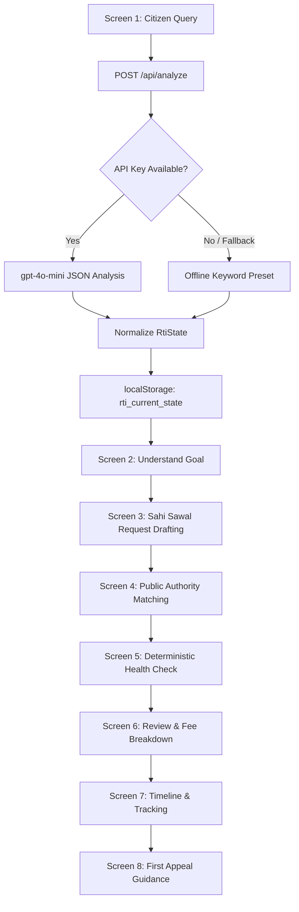

```markdown
# 🏛 RTI-Saarthi (आरटीआई सारथी)

> An AI-assisted, multilingual civic-tech platform designed to simplify, draft, and track Right to Information (RTI) applications for Indian citizens.

[](https://rti-saarthi.vercel.app)
[](https://nextjs.org/)
[](docs/ARCHITECTURE.md)

---

## 📌 Overview

Filing a Right to Information (RTI) request under the RTI Act, 2005 often presents friction due to bureaucratic jargon, ambiguous departmental jurisdictions, and complex drafting formats.

**RTI-Saarthi** acts as an intelligent digital assistant that converts informal, plain-language citizen questions into structured, legally aligned records requests under Section 6(1) of the RTI Act.

🔗 **Live Deployment:** [rti-saarthi.vercel.app](https://rti-saarthi.vercel.app)  
📖 **System Architecture:** Detailed screen specs & state flow available in [docs/ARCHITECTURE.md](docs/ARCHITECTURE.md).

---

## 🔄 End-to-End Workflow



---

## ✨ Core Highlights

* **Information vs. Grievance Separation:** Disambiguates RTI requests (information seeking) from grievance redressal mechanisms (demanding administrative actions).
* **8-Stage Guided Journey:** Progresses users through problem formulation, statutory authority matching, application health scoring, fee calculations, and escalation protocols (First Appeal under Section 19(1)).
* **Graceful Offline Fallback:** Operates seamlessly via keyword heuristic parsing even if LLM API limits are reached or unconfigured.
* **Multilingual Context:** Fully translated dynamic interfaces supporting bilingual and regional public accessibility.

---

## 🛠️ Tech Stack

* **Framework:** Next.js 16 (App Router, Turbopack)
* **UI & Styling:** React 19, Tailwind CSS v4, Lucide Icons
* **Language:** TypeScript (Strict checking)
* **State Management:** Client-side synchronized `localStorage` hydration
* **Deployment:** Vercel

---

## 🚀 Getting Started Locally

```bash
# 1. Clone repository
git clone [https://github.com/mohit-saini-dev/RTI-Saarthi.git](https://github.com/mohit-saini-dev/RTI-Saarthi.git)
cd RTI-Saarthi

# 2. Install dependencies
npm install

# 3. Start development server
npm run dev

```

Open [http://localhost:3000](http://localhost:3000) to view the application.

---

## ⚖ Disclaimer

*RTI-Saarthi is an independent civic-tech prototype developed for educational and hackathon demonstration purposes. It does not file official applications directly with public authorities. Official RTIs must be submitted through [rtionline.gov.in](https://rtionline.gov.in) or physical PIO counters.*

```

```