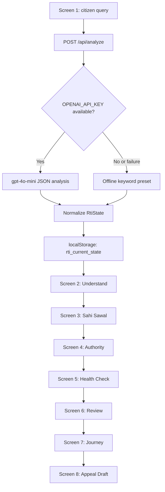

# RTI Saarthi Project Review

## 1. System Overview

RTI Saarthi is a Next.js App Router application that helps citizens turn plain-language public-service questions into structured, record-focused RTI requests.

The application has three core responsibilities:

1. Accept a citizen's natural-language question.
2. Analyze it into a domain, goal, records request, public authority, route guard, and deterministic health metadata.
3. Guide the citizen through an eight-screen flow before producing a mock submission and first-appeal draft.

The product deliberately separates information access from grievance resolution:

- RTI requests existing records and information.
- Grievance channels request action, such as releasing a delayed payment or repairing infrastructure.
- The UI warns citizens not to attach sensitive identity documents such as Aadhaar or PAN numbers.
- The submission journey is explicitly synthetic. No real RTI filing or payment occurs.

### Technology

- Next.js `16.3.3`
- React `19.2.8`
- TypeScript with strict checking
- Tailwind CSS v4
- `lucide-react` for interface icons
- OpenAI SDK for optional server-side analysis
- Browser `localStorage` for the current request state

### Repository Layout

```text
app/                         Active route adapters for the repository
src/app/                     Primary App Router implementations
src/app/api/analyze/         Universal POST analysis endpoint
src/components/              Shared GovernmentBanner and FaqAssistant
src/context/                 LanguageContext and translation dictionaries
src/lib/types.ts             Universal RTI state and demo data
src/lib/client-state.ts      Safe localStorage reader
public/                      Static assets
```

The repository contains a root `app/` tree with thin adapters that re-export implementations from `src/app/`. This is necessary because Next resolves the existing root `app/` directory as the active App Router tree.

## 2. End-to-End Architecture



### State Transport

Screen 1 sends only the current query to the server:

```ts
body: JSON.stringify({ query: question.trim() })
```

The returned normalized object is saved under:

```ts
localStorage.setItem("rti_current_state", JSON.stringify(data));
```

Downstream client screens call `readRtiState()` after mounting. The helper merges stored values with `defaultUniversalState`, which protects the UI if storage is empty, malformed, or missing fields.

```ts
export function readRtiState(): RtiState {
  if (typeof window === "undefined") return defaultUniversalState;

  try {
    const stored = window.localStorage.getItem("rti_current_state");
    return stored ? { ...defaultUniversalState, ...JSON.parse(stored) } : defaultUniversalState;
  } catch {
    return defaultUniversalState;
  }
}
```

## 3. Screen Flow: Screens 1 to 8

### Screen 1: Ask a Question (`/`)

File: `src/app/page.tsx`

Purpose:

- Presents the universal RTI entry point.
- Validates the query locally before analysis.
- Supports four translated sample query chips.
- Calls `/api/analyze`.
- Shows an analyzing state on the Continue button.
- Saves the returned state and navigates to `/understand`.

The local validation is intentionally lightweight and deterministic. It requires a query of at least 12 characters and a public-records topic such as pension, road, tender, scholarship, water, report, order, or status.

Visible content is sourced from `useLanguage()` for the translated badge, hero, subtitle, input label, placeholder, buttons, validation messages, preview labels, and sample chips.

### Screen 2: Understand the Goal (`/understand`)

File: `src/app/understand/page.tsx`

Purpose:

- Displays the saved citizen query.
- Shows the analyzed `state.goal`.
- Shows the RTI suitability explanation.
- Offers two paths:
  - Information path to `/question`.
  - Grievance path to the configured external grievance portal.

This is the route guard that explains what RTI can discover and what it cannot directly resolve.

### Screen 3: Sahi Sawal (`/question`)

File: `src/app/question/page.tsx`

Purpose:

- Presents `state.restructuredRequests` as numbered record requests.
- Allows the citizen to edit the request rows locally.
- Sends the citizen to `/authority` after confirming the records.

The requests are not generated in the component. They come from the persisted analyzer response, allowing infrastructure, scholarship, pension, civic, and general questions to follow the same UI.

### Screen 4: Authority Match (`/authority`)

File: `src/app/authority/page.tsx`

Purpose:

- Displays `state.suggestedAuthority`.
- Displays `state.authorityConfidence`.
- Displays `state.authorityReason`.
- Continues to `/health-check`.

The screen is client-rendered so it can hydrate from the browser's current request state.

### Screen 5: Deterministic Health Check (`/health-check`)

File: `src/app/health-check/page.tsx`

Purpose:

- Shows the analyzed health score.
- Displays authority, request type, specificity, privacy, and character checks.
- Shows the privacy reminder not to upload Aadhaar or PAN.
- Shows the jurisdiction shield.
- Continues to `/review`.

Dynamic values include:

- `state.healthScore`
- `state.jurisdiction`
- `state.privacyGuard`
- `state.characterCount`

### Screen 6: Review and Mock Submission (`/review`)

File: `src/app/review/page.tsx`

Purpose:

- Lists the persisted record requests.
- Shows the application fee as INR 10.
- Clearly labels the flow as mock-only.
- Simulates a short submission delay.
- Reveals `state.registrationNumber` after submission.
- Navigates to `/journey`.

No external filing or payment API is called from this screen.

### Screen 7: Track the Journey (`/journey`)

File: `src/app/journey/page.tsx`

Purpose:

- Displays the synthetic registration number.
- Shows a submitted-for-information status.
- Identifies the current analyzed domain.
- Continues to `/appeal`.

### Screen 8: First Appeal Guidance (`/appeal`)

File: `src/app/appeal/page.tsx`

Purpose:

- Builds a first-appeal draft from the current state.
- Includes the citizen query.
- Names the matched authority.
- Lists every requested record.
- Retains the synthetic registration number.
- Returns the citizen to `/` to start another question.

The draft is generated in the client from the current `RtiState`, so it changes automatically when a different query is analyzed.

## 4. Universal State Model

File: `src/lib/types.ts`

The principal state contract is `RtiState`:

```ts
export type RequestDomain =
  | "infrastructure"
  | "pension"
  | "scholarship"
  | "civic"
  | "general";

export interface RtiState {
  question: string;
  domain: RequestDomain;
  goal: string;
  suggestedAuthority: string;
  authorityReason: string;
  citizenGoal: string;
  suitabilityReason: string;
  restructuredRequests: string[];
  publicAuthority: string;
  jurisdiction: "Central" | "State" | "Municipal";
  authorityConfidence: number;
  betterGrievanceRoute: string;
  grievanceUrl: string;
  healthScore: number;
  characterCount: number;
  privacyGuard: string;
  pensionData: PensionRecord[];
  registrationNumber: string;
  validation: {
    isValid: boolean;
    label: string;
    detail: string;
  };
}
```

`goal`, `suggestedAuthority`, and `authorityReason` are the current field names used by Screens 2, 4, and 8. The older `citizenGoal`, `publicAuthority`, and `suitabilityReason` fields remain for compatibility with earlier screens and analyzer responses.

### Offline Demo State

`defaultUniversalState` represents an infrastructure query about Ward 4 road repair. It supplies a complete usable state when no analysis has been saved or the API is offline.

The state contains:

- Infrastructure domain
- Ward 4 road repair goal
- Municipal authority
- 94% authority confidence
- Five tender, measurement-book, inspection, contractor, and file-note requests
- Deterministic health score
- Mock registration number

## 5. Universal Analyze API

File: `src/app/api/analyze/route.ts`

The endpoint accepts a JSON POST body:

```ts
{ "query": "Road repair tender status in Ward 4" }
```

It returns an `RtiState` JSON object.

### Route Behavior

1. Parse the request body.
2. If the query is empty or `OPENAI_API_KEY` is absent, use `offlineState(query)`.
3. If an API key exists, call `gpt-4o-mini` with JSON response mode.
4. Parse the model response.
5. Normalize domain, jurisdiction, request count, confidence, health score, and character count.
6. If the network call, JSON parse, or model call fails, return the deterministic offline preset.

### OpenAI Request Excerpt

```ts
const completion = await client.chat.completions.create({
  model: "gpt-4o-mini",
  response_format: { type: "json_object" },
  messages: [
    {
      role: "system",
      content:
        "You are a careful Indian RTI request analyzer. Return only JSON matching the requested schema. RTI under Section 2(f) seeks existing records, not explanations, action, or opinions.",
    },
    {
      role: "user",
      content: `Analyze this citizen query: ${query}`,
    },
  ],
});
```

### Offline Classification

The offline classifier checks keywords in priority order:

- Pension: `pension`, `gratuity`, `epfo`, `credited`
- Scholarship: `scholarship`, `merit`, `stipend`, `disbursement`
- Infrastructure: `road`, `ward`, `pothole`, `tender`, `contractor`
- Default civic: all other queries

Each preset supplies its own goal, record requests, authority, confidence, jurisdiction, grievance route, and URL. This prevents every offline question from incorrectly becoming the Ward 4 infrastructure demo.

### Normalization Excerpt

```ts
function normalizeResult(query: string, result: Partial<RtiState>): RtiState {
  const fallback = offlineState(query);
  const domains: RequestDomain[] = [
    "infrastructure",
    "pension",
    "scholarship",
    "civic",
    "general",
  ];

  return {
    ...fallback,
    ...result,
    question: query.trim(),
    domain: domains.includes(result.domain as RequestDomain)
      ? result.domain as RequestDomain
      : fallback.domain,
    restructuredRequests:
      Array.isArray(result.restructuredRequests) &&
      result.restructuredRequests.length >= 4
        ? result.restructuredRequests.slice(0, 5).map(String)
        : fallback.restructuredRequests,
    characterCount: query.length,
  };
}
```

## 6. Screen 1 Code Excerpt

File: `src/app/page.tsx`

```tsx
"use client";

import { useState } from "react";
import { useRouter } from "next/navigation";
import { useLanguage } from "@/context/LanguageContext";

const sampleQuestionKeys = [
  "sample_chip_road",
  "sample_chip_pension",
  "sample_chip_scholarship",
  "sample_chip_water",
] as const;

export default function Home() {
  const [question, setQuestion] = useState("");
  const [isAnalyzing, setIsAnalyzing] = useState(false);
  const validation = validateQuestion(question);
  const router = useRouter();
  const { t } = useLanguage();

  async function continueToUnderstand() {
    if (!validation.isValid || isAnalyzing) return;
    setIsAnalyzing(true);

    try {
      const response = await fetch("/api/analyze", {
        method: "POST",
        headers: { "Content-Type": "application/json" },
        body: JSON.stringify({ query: question.trim() }),
      });
      const data = await response.json();
      localStorage.setItem("rti_current_state", JSON.stringify(data));
      router.push("/understand");
    } finally {
      setIsAnalyzing(false);
    }
  }
}
```

The input and translated chip behavior is:

```tsx
<textarea
  value={question}
  onChange={(event) => setQuestion(event.target.value)}
  placeholder={t("placeholder")}
/>

{sampleQuestionKeys.map((sampleQuestionKey) => (
  <button
    key={sampleQuestionKey}
    type="button"
    onClick={() => setQuestion(t(sampleQuestionKey))}
  >
    {t(sampleQuestionKey)}
  </button>
))}
```

## 7. Translation Architecture

File: `src/context/LanguageContext.tsx`

Supported language codes:

```ts
export type LanguageCode =
  | "en"
  | "hi"
  | "bn"
  | "te"
  | "mr"
  | "ta"
  | "gu"
  | "kn"
  | "ml"
  | "pa";
```

The dictionary uses a strict key contract:

```ts
export type TranslationKey =
  | "portal_title"
  | "brand_title"
  | "header_subtitle"
  | "checks_enabled"
  | "about"
  | "live_alert_badge"
  | "live_alert"
  | "screen_1_badge"
  | "hero_title"
  | "hero_sub"
  | "input_label"
  | "placeholder"
  | "btn_continue"
  | "btn_analyze"
  | "need_more_detail"
  | "question_clear"
  | "validation_clear_detail"
  | "recent_inquiries"
  | "clarity_card"
  | "faq_desk_btn"
  | "try_sample"
  | "sample_chip_road"
  | "sample_chip_pension"
  | "sample_chip_scholarship"
  | "sample_chip_water"
  | "your_records"
  | "records_count"
  | "item_road_title"
  | "item_road_dept"
  | "item_scholarship_title"
  | "item_scholarship_dept"
  | "item_water_title"
  | "item_water_dept"
  | "built_for_clarity";
```

Every locale is represented as a full `TranslationDictionary`, so `t()` does not need an English fallback:

```ts
type TranslationDictionary = Record<TranslationKey, string>;
const translations: Record<LanguageCode, TranslationDictionary> = {
  en: { /* complete English dictionary */ },
  hi: { /* complete Hindi dictionary */ },
  bn: { /* complete Bengali dictionary */ },
  te: { /* complete Telugu dictionary */ },
  mr: { /* complete Marathi dictionary */ },
  ta: { /* complete Tamil dictionary */ },
  gu: { /* complete Gujarati dictionary */ },
  kn: { /* complete Kannada dictionary */ },
  ml: { /* complete Malayalam dictionary */ },
  pa: { /* complete Punjabi dictionary */ },
};
```

### Provider Behavior

- Initial language is English.
- On mount, the provider reads `localStorage.getItem("rti_lang")`.
- Valid language codes are restored.
- `setLanguage()` updates React state and writes the selected code back to local storage.
- All shared components consume `useLanguage()`.

```tsx
const value = useMemo(
  () => ({
    language,
    setLanguage,
    t: (key: TranslationKey) => translations[language][key],
  }),
  [language],
);
```

### Shared Translation Consumers

- `GovernmentBanner.tsx`: portal title, language-independent controls, About label, live-alert badge, and live ticker.
- `FaqAssistant.tsx`: FAQ launcher and drawer title.
- `src/app/page.tsx`: Screen 1 brand, header subtitle, badge, hero, input, validation, buttons, preview, and sample chips.
- The root layout wraps all routes with `LanguageProvider`.

## 8. Shared Government Utility Layer

### GovernmentBanner

File: `src/components/GovernmentBanner.tsx`

Provides:

- Language selector with all 10 language codes.
- Native-script language labels.
- Font-size controls using `data-font-size` on the root HTML element.
- About modal linking to `/about`.
- Scrolling statutory alert ticker.

### FaqAssistant

File: `src/components/FaqAssistant.tsx`

Provides:

- Floating FAQ assistant button.
- Slide-over drawer.
- Search filtering across questions and answers.
- Expand/collapse behavior for each FAQ.
- Guidance about RTI versus grievances, record requests, 30-day timelines, First Appeals, and the INR 10 Central fee.

## 9. Safety and Product Boundaries

- The analyzer is informational and does not make a legal determination.
- RTI requests are framed around existing records under Section 2(f), not demands for action or new explanations.
- Privacy messaging discourages uploading Aadhaar and PAN numbers.
- The mock registration number is synthetic.
- The review screen does not process a payment.
- The external grievance link is separate from the RTI information path.

## 10. Validation Commands

Run from the repository root:

```powershell
npm run lint
npm run build
```

Expected build routes include:

```text
/
/about
/api/analyze
/appeal
/authority
/health-check
/journey
/question
/review
/understand
```

## 11. Evaluation Checklist

- [x] Natural-language query entry point
- [x] Universal domain state
- [x] OpenAI-backed analysis path
- [x] Deterministic offline presets
- [x] Persisted cross-screen state
- [x] Authority and jurisdiction guard
- [x] Privacy guard for identity documents
- [x] Mock-only submission flow
- [x] Dynamic first-appeal draft
- [x] 10-language translation provider
- [x] Persistent language selection
- [x] Government utility banner
- [x] Statutory live alert
- [x] FAQ assistant widget
- [x] About page and workflow comparison
=== FILE: C:\Users\Dell\changesentinel\rti-saarthi\src\app\about\page.tsx ===
import { ArrowRight, CheckCircle2, ClipboardList } from "lucide-react";
import Link from "next/link";

const comparisons = [
  { label: "Citizen starting point", standard: "Write a free-form question and hope it reaches the right desk.", saarthi: "Turn plain language into a focused records request." },
  { label: "Legal clarity", standard: "Limited guidance on what Section 2(f) and 2(j) cover.", saarthi: "Identify existing records that are concrete, checkable, and less likely to be rejected." },
  { label: "Filing confidence", standard: "Find the authority, fee, and next step yourself.", saarthi: "Match the authority, run privacy and jurisdiction guards, then review before filing." },
];

export default function AboutPage() {
  return (
    <main className="min-h-screen bg-[#f5f1e8] text-[#173c38]"><div className="mx-auto flex min-h-screen w-full max-w-7xl flex-col px-6 py-6 sm:px-10 lg:px-14"><header className="flex items-center justify-between border-b border-[#173c38]/15 pb-5"><Link href="/" className="flex items-center gap-3"><div className="flex size-10 items-center justify-center rounded-xl bg-[#173c38] text-[#f5f1e8]"><ClipboardList size={20} /></div><div><p className="text-sm font-bold tracking-[0.16em] uppercase">RTI Saarthi</p><p className="text-xs text-[#173c38]/60">Citizen Intelligence &amp; RTI Filing Layer</p></div></Link><Link href="/" className="text-sm font-bold text-[#c45b35] hover:underline">Back to home</Link></header><section className="mx-auto w-full max-w-5xl py-14 lg:py-20"><p className="mb-7 text-sm font-semibold text-[#c45b35]">About RTI Saarthi</p><h1 className="max-w-4xl text-5xl leading-[0.98] font-semibold tracking-[-0.04em] sm:text-7xl">Make the question clearer. Make the answer checkable.</h1><p className="mt-8 max-w-3xl text-xl leading-9 text-[#173c38]/70">Transforming plain-language citizen inquiries into valid, structured record requests to eliminate rejections under Section 2(f) and 2(j).</p><div className="mt-14 overflow-hidden rounded-2xl border border-[#173c38]/10 bg-[#fffdf8] shadow-[0_20px_45px_rgba(23,60,56,0.08)]"><div className="grid grid-cols-[1fr_1fr] border-b border-[#173c38]/10 bg-[#e5eee4] px-5 py-4 text-xs font-bold tracking-[0.12em] uppercase sm:grid-cols-[1fr_1fr_1fr]"><span>Workflow</span><span>rtionline.gov.in</span><span>RTI Saarthi</span></div>{comparisons.map((comparison) => <div key={comparison.label} className="grid grid-cols-[1fr_1fr] gap-x-5 border-b border-[#173c38]/10 px-5 py-5 last:border-0 sm:grid-cols-[1fr_1fr_1fr]"><p className="col-span-2 text-sm font-bold sm:col-span-1">{comparison.label}</p><p className="mt-2 text-sm leading-6 text-[#173c38]/60 sm:mt-0">{comparison.standard}</p><p className="mt-3 flex gap-2 text-sm leading-6 text-[#173c38]/80 sm:mt-0"><CheckCircle2 className="mt-0.5 shrink-0 text-[#27745e]" size={17} />{comparison.saarthi}</p></div>)}</div><div className="mt-10 flex flex-col gap-4 rounded-2xl bg-[#173c38] p-6 text-[#f5f1e8] sm:flex-row sm:items-center sm:justify-between"><p className="max-w-2xl text-lg leading-7">RTI Saarthi helps you ask for records. It does not promise outcomes or replace official filing channels.</p><Link href="/" className="flex min-h-12 shrink-0 items-center justify-center gap-2 rounded-xl bg-[#c45b35] px-5 py-3 text-sm font-bold transition hover:bg-[#a94728]">Ask a question <ArrowRight size={17} /></Link></div></section></div></main>
  );
}


=== FILE: C:\Users\Dell\changesentinel\rti-saarthi\src\app\api\analyze\route.ts ===
import OpenAI from "openai";
import { defaultUniversalState, type RequestDomain, type RtiState } from "@/src/lib/types";

export const runtime = "nodejs";

function offlineState(query: string): RtiState {
  const normalizedQuery = query.toLowerCase();
  const preset = normalizedQuery.match(/pension|gratuity|epfo|credited/)
    ? { domain: "pension" as const, goal: "Understand pension payment delay and file movement", requests: ["Copy of the sanction/release order for my pension", "Current status of my pension file", "Date last payment was processed", "Name/Designation of the dealing officer", "File notings/correspondence regarding the delay."], authority: "Department of Pension & Pensioners' Welfare (Central)", confidence: 91, jurisdiction: "Central" as const, reason: "Your question appears to concern a Central Government pension.", route: "CPGRAMS", url: "https://pgportal.gov.in" }
    : normalizedQuery.match(/scholarship|merit|stipend|disbursement/)
      ? { domain: "scholarship" as const, goal: "Obtain official sanction and disbursement records for National Merit Scholarship", requests: ["Certified copy of merit list sanction order", "DBT disbursement transaction failure log/reasons", "Current nodal officer designation", "Budget allocation and release status"], authority: "Ministry of Education / UGC", confidence: 89, jurisdiction: "Central" as const, reason: "The request concerns scholarship sanction and disbursement records.", route: "Scholarship grievance portal", url: "https://pgportal.gov.in" }
      : normalizedQuery.match(/road|ward|pothole|tender|contractor/)
        ? { domain: "infrastructure" as const, goal: "Inspect road repair tender status and contractor execution in Ward 4", requests: ["Certified copy of tender agreement and sanctioned timeline", "Measurement Book (MB) entries", "Inspection logbook", "Delay penalty records"], authority: "Public Works Department (PWD) / Municipal Corporation", confidence: 94, jurisdiction: "Municipal" as const, reason: "The request concerns a Municipal road infrastructure project.", route: "Municipal grievance portal", url: "https://pgportal.gov.in" }
        : { domain: "civic" as const, goal: "Obtain official public records and inspection logs for civic service request", requests: defaultUniversalState.restructuredRequests, authority: "Municipal Corporation / Civic Administration", confidence: 85, jurisdiction: "Municipal" as const, reason: "The request concerns a civic service and its official records.", route: "Municipal grievance portal", url: "https://pgportal.gov.in" };
  return { ...defaultUniversalState, question: query.trim() || defaultUniversalState.question, domain: preset.domain, goal: preset.goal, citizenGoal: preset.goal, suggestedAuthority: preset.authority, publicAuthority: preset.authority, authorityReason: preset.reason, restructuredRequests: preset.requests, authorityConfidence: preset.confidence, jurisdiction: preset.jurisdiction, betterGrievanceRoute: preset.route, grievanceUrl: preset.url, characterCount: query.length };
}

function normalizeResult(query: string, result: Partial<RtiState>): RtiState {
  const fallback = offlineState(query);
  const domains: RequestDomain[] = ["infrastructure", "pension", "scholarship", "civic", "general"];
  const jurisdictions: RtiState["jurisdiction"][] = ["Central", "State", "Municipal"];
  return {
    ...fallback,
    ...result,
    question: query.trim(),
    domain: domains.includes(result.domain as RequestDomain) ? result.domain as RequestDomain : fallback.domain,
    jurisdiction: jurisdictions.includes(result.jurisdiction as RtiState["jurisdiction"]) ? result.jurisdiction as RtiState["jurisdiction"] : fallback.jurisdiction,
    restructuredRequests: Array.isArray(result.restructuredRequests) && result.restructuredRequests.length >= 4 ? result.restructuredRequests.slice(0, 5).map(String) : fallback.restructuredRequests,
    authorityConfidence: typeof result.authorityConfidence === "number" ? result.authorityConfidence : fallback.authorityConfidence,
    healthScore: typeof result.healthScore === "number" ? result.healthScore : fallback.healthScore,
    characterCount: query.length,
  };
}

export async function POST(request: Request) {
  const body = await request.json().catch(() => null) as { query?: unknown } | null;
  const query = typeof body?.query === "string" ? body.query : "";

  if (!query.trim() || !process.env.OPENAI_API_KEY) {
    return Response.json(offlineState(query));
  }

  try {
    const client = new OpenAI({ apiKey: process.env.OPENAI_API_KEY });
    const completion = await client.chat.completions.create({
      model: "gpt-4o-mini",
      response_format: { type: "json_object" },
      messages: [
        { role: "system", content: "You are a careful Indian RTI request analyzer. Return only JSON matching the requested schema. RTI under Section 2(f) seeks existing records, not explanations, action, or opinions. Suggest 4-5 precise record requests such as certified work orders, measurement books, file notings, inspection registers, and officer designations. Never request Aadhaar, PAN, or sensitive identity documents." },
        { role: "user", content: `Analyze this citizen query: ${query}\nReturn JSON with: domain (infrastructure|pension|scholarship|civic|general), citizenGoal, suitabilityReason, restructuredRequests (array of 4-5 strings), publicAuthority, jurisdiction (Central|State|Municipal), authorityConfidence (0-100), betterGrievanceRoute, grievanceUrl, healthScore (0-100), privacyGuard.` },
      ],
    });
    const content = completion.choices[0]?.message.content;
    const parsed = content ? JSON.parse(content) as Partial<RtiState> : {};
    if (parsed.goal && !parsed.citizenGoal) parsed.citizenGoal = parsed.goal;
    if (parsed.suggestedAuthority && !parsed.publicAuthority) parsed.publicAuthority = parsed.suggestedAuthority;
    if (parsed.authorityReason && !parsed.suitabilityReason) parsed.suitabilityReason = parsed.authorityReason;
    return Response.json(normalizeResult(query, parsed));
  } catch {
    return Response.json(offlineState(query));
  }
}


=== FILE: C:\Users\Dell\changesentinel\rti-saarthi\src\app\appeal\page.tsx ===
"use client";

import { CheckCircle2, ClipboardList, ShieldCheck } from "lucide-react";
import Link from "next/link";
import { useEffect, useState } from "react";
import { defaultUniversalState, type RtiState } from "@/src/lib/types";
import { readRtiState } from "@/src/lib/client-state";

export default function AppealPage() {
  const [state, setState] = useState<RtiState>(defaultUniversalState);
  useEffect(() => {
    const updateState = window.setTimeout(() => setState(readRtiState()), 0);
    return () => window.clearTimeout(updateState);
  }, []);
  const draft = `Subject: First Appeal regarding RTI request on ${state.question}\n\nTo the First Appellate Authority of ${state.suggestedAuthority},\n\nI seek a review of the response or delay relating to my RTI request. The requested records were:\n${state.restructuredRequests.map((request, index) => `${index + 1}. ${request}`).join("\n")}\n\nPlease provide the information and action required under the RTI Act.`;

  return (
    <main className="min-h-screen bg-[#f5f1e8] text-[#173c38]"><div className="mx-auto flex min-h-screen w-full max-w-7xl flex-col px-6 py-6 sm:px-10 lg:px-14">
      <header className="flex items-center justify-between border-b border-[#173c38]/15 pb-5"><Link href="/" className="flex items-center gap-3"><div className="flex size-10 items-center justify-center rounded-xl bg-[#173c38] text-[#f5f1e8]"><ClipboardList size={20} /></div><div><p className="text-sm font-bold tracking-[0.16em] uppercase">RTI Saarthi</p><p className="text-xs text-[#173c38]/60">Citizen Intelligence &amp; RTI Filing Layer</p></div></Link><div className="hidden items-center gap-2 text-xs font-semibold text-[#173c38]/60 sm:flex"><ShieldCheck size={16} /> First appeal draft</div></header>
      <section className="mx-auto flex w-full max-w-4xl flex-1 flex-col justify-center py-14 lg:py-20"><div className="mb-7 flex items-center gap-2 text-sm font-semibold text-[#c45b35]"><ShieldCheck size={17} /> Screen 8 / Appeal guidance</div><h1 className="max-w-2xl text-5xl leading-[0.98] font-semibold tracking-[-0.04em] sm:text-7xl">Ready for the next step.</h1><p className="mt-7 max-w-xl text-lg leading-8 text-[#173c38]/70">This draft reflects your question, requested records, and matched authority.</p><div className="mt-10 rounded-2xl border border-[#27745e]/25 bg-[#e5eee4] p-6 shadow-[0_18px_40px_rgba(23,60,56,0.06)] sm:p-8"><div className="flex items-center gap-3 text-[#27745e]"><CheckCircle2 size={20} /><p className="font-bold">First Appeal draft</p></div><textarea readOnly value={draft} rows={12} className="mt-5 w-full resize-y rounded-xl border border-[#173c38]/10 bg-[#fffdf8] p-4 text-sm leading-6 text-[#173c38] outline-none" /><p className="mt-4 text-sm leading-7 text-[#173c38]/70">Keep registration number {state.registrationNumber} and any reply you receive.</p><Link href="/" className="mt-7 inline-flex min-h-12 items-center justify-center rounded-xl border border-[#173c38]/20 px-5 py-3 text-sm font-bold transition hover:border-[#173c38] hover:bg-white">Start another question</Link></div></section>
    </div></main>
  );
}


=== FILE: C:\Users\Dell\changesentinel\rti-saarthi\src\app\authority\page.tsx ===
"use client";

import { ArrowRight, Building2, ClipboardList, ShieldCheck } from "lucide-react";
import Link from "next/link";
import { useEffect, useState } from "react";
import { defaultUniversalState, type RtiState } from "@/src/lib/types";
import { readRtiState } from "@/src/lib/client-state";

export default function AuthorityPage() {
  const [state, setState] = useState<RtiState>(defaultUniversalState);
  useEffect(() => {
    const updateState = window.setTimeout(() => setState(readRtiState()), 0);
    return () => window.clearTimeout(updateState);
  }, []);

  return (
    <main className="min-h-screen bg-[#f5f1e8] text-[#173c38]"><div className="mx-auto flex min-h-screen w-full max-w-7xl flex-col px-6 py-6 sm:px-10 lg:px-14">
      <header className="flex items-center justify-between border-b border-[#173c38]/15 pb-5"><Link href="/" className="flex items-center gap-3"><div className="flex size-10 items-center justify-center rounded-xl bg-[#173c38] text-[#f5f1e8]"><ClipboardList size={20} /></div><div><p className="text-sm font-bold tracking-[0.16em] uppercase">RTI Saarthi</p><p className="text-xs text-[#173c38]/60">Citizen Intelligence &amp; RTI Filing Layer</p></div></Link><div className="hidden items-center gap-2 text-xs font-semibold text-[#173c38]/60 sm:flex"><ShieldCheck size={16} /> Authority match</div></header>
      <section className="mx-auto flex w-full max-w-3xl flex-1 flex-col justify-center py-14 lg:py-20"><div className="mb-7 flex items-center gap-2 text-sm font-semibold text-[#c45b35]"><ShieldCheck size={17} /> Screen 4 / Authority match</div><h1 className="max-w-2xl text-5xl leading-[0.98] font-semibold tracking-[-0.04em] sm:text-7xl">Who should receive this request?</h1><p className="mt-7 max-w-xl text-lg leading-8 text-[#173c38]/70">We matched your records request to the authority most likely to hold the information.</p>
        <div className="mt-10 rounded-2xl border border-[#173c38]/10 bg-[#fffdf8] p-6 shadow-[0_24px_50px_rgba(23,60,56,0.1)] sm:p-8"><div className="flex flex-col gap-5 sm:flex-row sm:items-start sm:justify-between"><div className="flex items-start gap-4"><div className="flex size-12 shrink-0 items-center justify-center rounded-xl bg-[#e5eee4] text-[#27745e]"><Building2 size={23} /></div><div><p className="text-xs font-bold tracking-[0.14em] text-[#c45b35] uppercase">Matched authority</p><h2 className="mt-2 text-2xl leading-8 font-semibold">{state.suggestedAuthority}</h2></div></div><span className="w-fit shrink-0 rounded-full bg-[#e5eee4] px-3 py-1.5 text-xs font-bold text-[#27745e]">Confidence: {state.authorityConfidence}%</span></div><div className="mt-7 border-t border-[#173c38]/10 pt-5"><p className="text-xs font-bold tracking-[0.12em] text-[#173c38]/50 uppercase">Why this match</p><p className="mt-2 text-base leading-7 text-[#173c38]/70">{state.authorityReason}</p></div><Link href="/health-check" className="mt-8 flex min-h-12 items-center justify-center gap-2 rounded-xl bg-[#c45b35] px-5 py-3 text-center text-sm font-bold text-white transition hover:bg-[#a94728]">Looks right, continue <ArrowRight size={17} /></Link></div>
      </section>
    </div></main>
  );
}


=== FILE: C:\Users\Dell\changesentinel\rti-saarthi\src\app\health-check\page.tsx ===
"use client";

import { ArrowRight, CheckCircle2, ClipboardList, ShieldCheck } from "lucide-react";
import Link from "next/link";
import { useEffect, useState } from "react";
import { defaultUniversalState, type RtiState } from "@/src/lib/types";
import { readRtiState } from "@/src/lib/client-state";

export default function HealthCheckPage() {
  const [state, setState] = useState<RtiState>(defaultUniversalState);
  useEffect(() => {
    const updateState = window.setTimeout(() => setState(readRtiState()), 0);

    return () => window.clearTimeout(updateState);
  }, []);
  const checks = [
    { label: "Authority", value: state.jurisdiction, detail: "Verified" },
    { label: "Request Type", value: "Records", detail: "Passed" },
    { label: "Specificity", value: "Clear", detail: "Passed" },
    { label: "Privacy Guard", value: "PASS", detail: state.privacyGuard },
    { label: "Character Limit", value: `${state.characterCount} / 3000`, detail: "Passed" },
  ];
  return (
    <main className="min-h-screen overflow-hidden bg-[#f5f1e8] text-[#173c38]">
      <div className="mx-auto flex min-h-screen w-full max-w-7xl flex-col px-6 py-6 sm:px-10 lg:px-14">
        <header className="flex items-center justify-between border-b border-[#173c38]/15 pb-5">
          <Link href="/" className="flex items-center gap-3">
            <div className="flex size-10 items-center justify-center rounded-xl bg-[#173c38] text-[#f5f1e8]"><ClipboardList size={20} strokeWidth={1.8} /></div>
            <div><p className="text-sm font-bold tracking-[0.16em] uppercase">RTI Saarthi</p><p className="text-xs text-[#173c38]/60">Citizen Intelligence &amp; RTI Filing Layer</p></div>
                      <div><p className="text-sm font-bold tracking-[0.16em] uppercase">RTI Saarthi</p><p className="text-xs text-[#173c38]/60">Citizen Intelligence &amp; RTI Filing Layer</p></div>
          </Link>
          <div className="hidden items-center gap-2 text-xs font-semibold text-[#173c38]/60 sm:flex"><ShieldCheck size={16} /> Deterministic health check</div>
        </header>

        <section className="mx-auto flex w-full max-w-4xl flex-1 flex-col justify-center py-12 lg:py-16">
          <div className="mb-7 flex items-center gap-2 text-sm font-semibold text-[#c45b35]"><ShieldCheck size={17} /> Screen 5 / Health check</div>
          <div className="flex flex-col gap-7 sm:flex-row sm:items-end sm:justify-between">
            <div><h1 className="max-w-2xl text-5xl leading-[0.98] font-semibold tracking-[-0.04em] sm:text-7xl">Ready for a clean filing.</h1><p className="mt-6 max-w-xl text-lg leading-8 text-[#173c38]/70">A few deterministic checks keep your RTI request focused, answerable, and safe to submit.</p></div>
            <div className="flex size-32 shrink-0 flex-col items-center justify-center rounded-full border-[10px] border-[#c8dfc3] bg-[#173c38] text-[#f5f1e8] shadow-[0_18px_40px_rgba(23,60,56,0.15)]"><span className="text-4xl font-semibold">{state.healthScore}</span><span className="text-xs font-bold tracking-[0.12em] uppercase opacity-70">out of 100</span></div>
          </div>

          <div className="mt-10 overflow-hidden rounded-2xl border border-[#173c38]/10 bg-[#fffdf8] shadow-[0_20px_45px_rgba(23,60,56,0.08)]">
            {checks.map((check, index) => (
              <div key={check.label} className={`flex flex-col gap-2 px-5 py-4 sm:flex-row sm:items-center sm:justify-between sm:gap-5 ${index > 0 ? "border-t border-[#173c38]/10" : ""}`}>
                <div className="flex items-center gap-3"><CheckCircle2 className="shrink-0 text-[#27745e]" size={19} /><p className="text-sm font-bold">{check.label}</p></div>
                <div className="flex items-center gap-3 pl-8 sm:pl-0"><span className="text-sm font-semibold">{check.value}</span><span className="rounded-full bg-[#e5eee4] px-2.5 py-1 text-xs font-bold text-[#27745e]">{check.detail}</span></div>
              </div>
            ))}
          </div>

          <div className="mt-4 flex items-start gap-3 rounded-2xl bg-[#f3dfc9] px-5 py-4 text-sm leading-6 text-[#173c38]/80"><ShieldCheck className="mt-0.5 shrink-0 text-[#c45b35]" size={18} /><p><strong className="font-bold text-[#173c38]">Privacy reminder:</strong> No identity documents are needed. Do not upload your Aadhaar or PAN.</p></div>
          <div className="mt-4 flex flex-col gap-4 rounded-2xl border border-[#27745e]/25 bg-[#e5eee4] px-5 py-4 sm:flex-row sm:items-center sm:justify-between"><div><p className="text-xs font-bold tracking-[0.12em] text-[#27745e] uppercase">Jurisdiction shield</p><p className="mt-1 font-bold">PASS <span className="font-normal text-[#173c38]/65">({state.jurisdiction} subject)</span></p></div><Link href="/review" className="flex min-h-12 items-center justify-center gap-2 rounded-xl bg-[#c45b35] px-5 py-3 text-center text-sm font-bold text-white transition hover:bg-[#a94728]">Review &amp; submit <ArrowRight size={17} /></Link></div>
        </section>
      </div>
    </main>
  );
}


=== FILE: C:\Users\Dell\changesentinel\rti-saarthi\src\app\journey\page.tsx ===
"use client";

import { ArrowRight, CheckCircle2, ClipboardList, ShieldCheck } from "lucide-react";
import Link from "next/link";
import { useEffect, useState } from "react";
import { defaultUniversalState, type RtiState } from "@/src/lib/types";
import { readRtiState } from "@/src/lib/client-state";

export default function JourneyPage() {
  const [state, setState] = useState<RtiState>(defaultUniversalState);
  useEffect(() => {
    const updateState = window.setTimeout(() => setState(readRtiState()), 0);

    return () => window.clearTimeout(updateState);
  }, []);

  return (
    <main className="min-h-screen overflow-hidden bg-[#f5f1e8] text-[#173c38]">
      <div className="mx-auto flex min-h-screen w-full max-w-7xl flex-col px-6 py-6 sm:px-10 lg:px-14">
        <header className="flex items-center justify-between border-b border-[#173c38]/15 pb-5">
          <Link href="/" className="flex items-center gap-3"><div className="flex size-10 items-center justify-center rounded-xl bg-[#173c38] text-[#f5f1e8]"><ClipboardList size={20} strokeWidth={1.8} /></div><div><p className="text-sm font-bold tracking-[0.16em] uppercase">RTI Saarthi</p><p className="text-xs text-[#173c38]/60">Citizen Intelligence &amp; RTI Filing Layer</p></div></Link>
                    <Link href="/" className="flex items-center gap-3"><div className="flex size-10 items-center justify-center rounded-xl bg-[#173c38] text-[#f5f1e8]"><ClipboardList size={20} strokeWidth={1.8} /></div><div><p className="text-sm font-bold tracking-[0.16em] uppercase">RTI Saarthi</p><p className="text-xs text-[#173c38]/60">Citizen Intelligence &amp; RTI Filing Layer</p></div></Link>
          <div className="hidden items-center gap-2 text-xs font-semibold text-[#173c38]/60 sm:flex"><ShieldCheck size={16} /> Demo journey</div>
        </header>
        <section className="mx-auto flex w-full max-w-3xl flex-1 flex-col justify-center py-14 lg:py-20">
          <div className="mb-7 flex items-center gap-2 text-sm font-semibold text-[#c45b35]"><ShieldCheck size={17} /> Screen 7 / Track your RTI</div>
          <h1 className="max-w-2xl text-5xl leading-[0.98] font-semibold tracking-[-0.04em] sm:text-7xl">Your RTI journey is underway.</h1>
          <p className="mt-7 max-w-xl text-lg leading-8 text-[#173c38]/70">This demo request is registered as <strong className="font-bold text-[#173c38]">{state.registrationNumber}</strong>. Follow the next step when you need to escalate a delayed response.</p>
          <div className="mt-10 rounded-2xl border border-[#173c38]/10 bg-[#fffdf8] p-6 shadow-[0_20px_45px_rgba(23,60,56,0.08)] sm:p-8">
            <div className="flex items-center gap-3 text-[#27745e]"><CheckCircle2 size={20} /><p className="font-bold">Demo submission recorded</p></div>
            <div className="mt-6 border-t border-[#173c38]/10 pt-5"><p className="text-xs font-bold tracking-[0.12em] text-[#173c38]/50 uppercase">Current status</p><p className="mt-2 text-xl font-semibold">Submitted for information</p><p className="mt-2 text-sm leading-6 text-[#173c38]/65">No real filing was made. This synthetic journey for {state.domain} is ready for the appeal step.</p></div>
            <Link href="/appeal" className="mt-8 flex min-h-12 items-center justify-center gap-2 rounded-xl bg-[#c45b35] px-5 py-3 text-center text-sm font-bold text-white transition hover:bg-[#a94728]">Continue to appeal <ArrowRight size={17} /></Link>
          </div>
        </section>
      </div>
    </main>
  );
}


=== FILE: C:\Users\Dell\changesentinel\rti-saarthi\src\app\question\page.tsx ===
"use client";

import { ArrowRight, Check, ClipboardList, Pencil, ShieldCheck } from "lucide-react";
import Link from "next/link";
import { useEffect, useState } from "react";
import { initialDemoState } from "@/src/lib/types";
import { readRtiState } from "@/src/lib/client-state";

export default function QuestionPage() {
  const [isEditing, setIsEditing] = useState(false);
  const [requests, setRequests] = useState(initialDemoState.restructuredRequests);

  useEffect(() => {
    const currentState = readRtiState();
    const updateRequests = window.setTimeout(() => setRequests(currentState.restructuredRequests), 0);

    return () => window.clearTimeout(updateRequests);
  }, []);

  return (
    <main className="min-h-screen overflow-hidden bg-[#f5f1e8] text-[#173c38]">
      <div className="mx-auto flex min-h-screen w-full max-w-7xl flex-col px-6 py-6 sm:px-10 lg:px-14">
        <header className="flex items-center justify-between border-b border-[#173c38]/15 pb-5">
          <Link href="/" className="flex items-center gap-3">
            <div className="flex size-10 items-center justify-center rounded-xl bg-[#173c38] text-[#f5f1e8]">
              <ClipboardList size={20} strokeWidth={1.8} />
            </div>
            <div>
              <p className="text-sm font-bold tracking-[0.16em] uppercase">RTI Saarthi</p>
              <p className="text-xs text-[#173c38]/60">Citizen Intelligence &amp; RTI Filing Layer</p>
                          <p className="text-xs text-[#173c38]/60">Citizen Intelligence &amp; RTI Filing Layer</p>
            </div>
          </Link>
          <div className="hidden items-center gap-2 text-xs font-semibold text-[#173c38]/60 sm:flex">
            <ShieldCheck size={16} />
            Sahi Sawal
          </div>
        </header>

        <section className="mx-auto flex w-full max-w-4xl flex-1 flex-col justify-center py-14 lg:py-20">
          <div className="mb-7 flex items-center gap-2 text-sm font-semibold text-[#c45b35]">
            <ShieldCheck size={17} />
            Screen 3 / Sahi Sawal
          </div>
          <h1 className="max-w-3xl text-4xl leading-[1.05] font-semibold tracking-[-0.035em] sm:text-6xl">
            Ask for records, not explanations.
          </h1>
          <p className="mt-7 max-w-3xl text-lg leading-8 text-[#173c38]/70">
            &quot;Why hasn&apos;t it been credited&quot; asks for an explanation. RTI works best with specific record requests. Here is what you can actually ask for:
          </p>

          <div className="mt-10 space-y-3">
            {requests.map((request, index) => (
              <div key={index} className="flex items-center gap-4 rounded-2xl border border-[#173c38]/10 bg-[#fffdf8] px-5 py-4 shadow-[0_12px_30px_rgba(23,60,56,0.06)]">
                <span className="flex size-9 shrink-0 items-center justify-center rounded-full bg-[#e5eee4] text-sm font-bold text-[#27745e]">
                  {index + 1}
                </span>
                {isEditing ? (
                  <input
                    aria-label={`Record request ${index + 1}`}
                    value={request}
                    onChange={(event) => setRequests((current) => current.map((item, itemIndex) => itemIndex === index ? event.target.value : item))}
                    className="min-w-0 flex-1 border-b border-[#c45b35] bg-transparent py-1 text-base leading-7 outline-none"
                  />
                ) : (
                  <p className="text-base leading-7 font-medium">{request}</p>
                )}
              </div>
            ))}
          </div>

          <div className="mt-10 flex flex-col-reverse gap-3 sm:flex-row sm:items-center sm:justify-between">
            <button type="button" onClick={() => setIsEditing((current) => !current)} className="flex min-h-12 items-center justify-center gap-2 rounded-xl border border-[#173c38]/20 px-5 py-3 text-sm font-bold transition hover:border-[#173c38] hover:bg-white">
              {isEditing ? <Check size={16} /> : <Pencil size={16} />}
              {isEditing ? "Done editing" : "Edit"}
            </button>
            <Link href="/authority" className="flex min-h-12 items-center justify-center gap-2 rounded-xl bg-[#c45b35] px-5 py-3 text-center text-sm font-bold text-white transition hover:bg-[#a94728]">
              Use these records <ArrowRight size={17} />
            </Link>
          </div>
        </section>
      </div>
    </main>
  );
}


=== FILE: C:\Users\Dell\changesentinel\rti-saarthi\src\app\review\page.tsx ===
"use client";

import { ArrowRight, CheckCircle2, ClipboardList, LoaderCircle, ShieldCheck } from "lucide-react";
import Link from "next/link";
import { useEffect, useState } from "react";
import { defaultUniversalState, type RtiState } from "@/src/lib/types";
import { readRtiState } from "@/src/lib/client-state";

export default function ReviewPage() {
  const [isSubmitting, setIsSubmitting] = useState(false);
  const [isSubmitted, setIsSubmitted] = useState(false);
  const [state, setState] = useState<RtiState>(defaultUniversalState);

  useEffect(() => {
    const updateState = window.setTimeout(() => setState(readRtiState()), 0);

    return () => window.clearTimeout(updateState);
  }, []);

  function submitDemo() {
    setIsSubmitting(true);
    window.setTimeout(() => {
      setIsSubmitting(false);
      setIsSubmitted(true);
    }, 900);
  }

  return (
    <main className="min-h-screen overflow-hidden bg-[#f5f1e8] text-[#173c38]">
      <div className="mx-auto flex min-h-screen w-full max-w-7xl flex-col px-6 py-6 sm:px-10 lg:px-14">
        <header className="flex items-center justify-between border-b border-[#173c38]/15 pb-5">
          <Link href="/" className="flex items-center gap-3"><div className="flex size-10 items-center justify-center rounded-xl bg-[#173c38] text-[#f5f1e8]"><ClipboardList size={20} strokeWidth={1.8} /></div><div><p className="text-sm font-bold tracking-[0.16em] uppercase">RTI Saarthi</p><p className="text-xs text-[#173c38]/60">Citizen Intelligence &amp; RTI Filing Layer</p></div></Link>
                    <Link href="/" className="flex items-center gap-3"><div className="flex size-10 items-center justify-center rounded-xl bg-[#173c38] text-[#f5f1e8]"><ClipboardList size={20} strokeWidth={1.8} /></div><div><p className="text-sm font-bold tracking-[0.16em] uppercase">RTI Saarthi</p><p className="text-xs text-[#173c38]/60">Citizen Intelligence &amp; RTI Filing Layer</p></div></Link>
          <div className="hidden items-center gap-2 text-xs font-semibold text-[#173c38]/60 sm:flex"><ShieldCheck size={16} /> Review &amp; mock submission</div>
        </header>

        <section className="mx-auto flex w-full max-w-4xl flex-1 flex-col justify-center py-12 lg:py-16">
          <div className="mb-7 flex items-center gap-2 text-sm font-semibold text-[#c45b35]"><ShieldCheck size={17} /> Screen 6 / Review &amp; submit</div>
          <h1 className="max-w-2xl text-5xl leading-[0.98] font-semibold tracking-[-0.04em] sm:text-7xl">One last look before you send.</h1>
          <p className="mt-6 max-w-xl text-lg leading-8 text-[#173c38]/70">Your request is ready. Check the records below, then submit this safe demonstration filing.</p>

          <div className="mt-10 rounded-2xl border border-[#173c38]/10 bg-[#fffdf8] p-6 shadow-[0_20px_45px_rgba(23,60,56,0.08)] sm:p-8">
            <div className="flex flex-col gap-4 border-b border-[#173c38]/10 pb-5 sm:flex-row sm:items-center sm:justify-between"><div><p className="text-xs font-bold tracking-[0.14em] text-[#c45b35] uppercase">Requested records</p><h2 className="mt-1 text-2xl font-semibold">Five items for review</h2></div><span className="w-fit rounded-full bg-[#e5eee4] px-3 py-1.5 text-xs font-bold text-[#27745e]">Application fee: ₹10</span></div>
            <ol className="mt-5 space-y-3">{state.restructuredRequests.map((request, index) => <li key={request} className="flex gap-3 text-sm leading-6"><span className="flex size-6 shrink-0 items-center justify-center rounded-full bg-[#e5eee4] text-xs font-bold text-[#27745e]">{index + 1}</span><span>{request}</span></li>)}</ol>
          </div>

          <div className="mt-4 flex items-start gap-3 rounded-2xl border border-[#c45b35]/25 bg-[#f3dfc9] px-5 py-4 text-sm leading-6"><ShieldCheck className="mt-0.5 shrink-0 text-[#c45b35]" size={18} /><p><strong className="font-bold">MOCK — No real filing or payment will occur</strong><br /><span className="text-[#173c38]/70">This is a synthetic journey for demonstration only.</span></p></div>

          {!isSubmitted ? <button type="button" onClick={submitDemo} disabled={isSubmitting} className="mt-6 flex min-h-12 w-full items-center justify-center gap-2 rounded-xl bg-[#c45b35] px-5 py-3 text-sm font-bold text-white transition hover:bg-[#a94728] disabled:cursor-wait disabled:opacity-70">{isSubmitting ? <><LoaderCircle className="animate-spin" size={17} /> Creating demo submission...</> : <>Submit Demo RTI <ArrowRight size={17} /></>}</button> : <div className="mt-6 rounded-2xl border border-[#27745e]/25 bg-[#e5eee4] p-5"><div className="flex items-center gap-2 text-[#27745e]"><CheckCircle2 size={19} /><p className="font-bold">Demo RTI submitted</p></div><p className="mt-3 text-sm text-[#173c38]/65">Synthetic registration number</p><p className="mt-1 text-2xl font-semibold tracking-[0.04em]">{state.registrationNumber}</p><Link href="/journey" className="mt-5 flex min-h-12 items-center justify-center gap-2 rounded-xl bg-[#173c38] px-5 py-3 text-center text-sm font-bold text-[#f5f1e8] transition hover:bg-[#26534e]">Track RTI Journey <ArrowRight size={17} /></Link></div>}
        </section>
      </div>
    </main>
  );
}


=== FILE: C:\Users\Dell\changesentinel\rti-saarthi\src\app\understand\page.tsx ===
"use client";

import { ArrowRight, ClipboardList, ExternalLink, ShieldCheck } from "lucide-react";
import Link from "next/link";
import { useEffect, useState } from "react";
import { defaultUniversalState, type RtiState } from "@/src/lib/types";
import { readRtiState } from "@/src/lib/client-state";

export default function UnderstandPage() {
  const [state, setState] = useState<RtiState>(defaultUniversalState);

  useEffect(() => {
    const updateState = window.setTimeout(() => setState(readRtiState()), 0);

    return () => window.clearTimeout(updateState);
  }, []);

  return (
    <main className="min-h-screen overflow-hidden bg-[#f5f1e8] text-[#173c38]">
      <div className="mx-auto flex min-h-screen w-full max-w-7xl flex-col px-6 py-6 sm:px-10 lg:px-14">
        <header className="flex items-center justify-between border-b border-[#173c38]/15 pb-5">
          <Link href="/" className="flex items-center gap-3">
            <div className="flex size-10 items-center justify-center rounded-xl bg-[#173c38] text-[#f5f1e8]">
              <ClipboardList size={20} strokeWidth={1.8} />
            </div>
            <div>
              <p className="text-sm font-bold tracking-[0.16em] text-[#173c38] uppercase">RTI Saarthi</p>
              <p className="text-xs text-[#173c38]/60">Citizen Intelligence &amp; RTI Filing Layer</p>
                          <p className="text-xs text-[#173c38]/60">Citizen Intelligence &amp; RTI Filing Layer</p>
            </div>
          </Link>
          <div className="hidden items-center gap-2 text-xs font-semibold text-[#173c38]/60 sm:flex">
            <ShieldCheck size={16} />
            Route guard
          </div>
        </header>

        <section className="mx-auto flex w-full max-w-4xl flex-1 flex-col justify-center py-14 lg:py-20">
          <div className="mb-7 flex items-center gap-2 text-sm font-semibold text-[#c45b35]">
            <ShieldCheck size={17} />
            Screen 2 / Understand your goal
          </div>
          <p className="max-w-2xl rounded-2xl border border-[#173c38]/10 bg-white px-5 py-4 text-lg leading-8 text-[#173c38]/75 shadow-[0_18px_45px_rgba(23,60,56,0.06)]">
            “{state.question}”
          </p>

          <div className="mt-10 max-w-3xl">
            <h1 className="max-w-2xl text-5xl leading-[0.98] font-semibold tracking-[-0.04em] text-[#173c38] sm:text-7xl">
              {state.goal}
            </h1>
            <p className="mt-7 max-w-2xl text-lg leading-8 text-[#173c38]/70">
              {state.suitabilityReason}
            </p>
          </div>

          <div className="mt-12 grid gap-4 md:grid-cols-2">
            <div className="flex flex-col justify-between rounded-2xl border border-[#173c38]/10 bg-[#fffdf8] p-6 shadow-[0_18px_45px_rgba(23,60,56,0.08)]">
              <div>
                <p className="text-xs font-bold tracking-[0.14em] text-[#c45b35] uppercase">Information route</p>
                <h2 className="mt-3 text-2xl font-semibold">Find out what happened</h2>
                <p className="mt-3 leading-7 text-[#173c38]/65">
                  Use RTI to request the status, file movement, and reasons behind the delay.
                </p>
              </div>
              <Link
                href="/question"
                className="mt-8 flex min-h-12 items-center justify-center gap-2 rounded-xl bg-[#c45b35] px-5 py-3 text-center text-sm font-bold text-white transition hover:bg-[#a94728]"
              >
                Find out what happened <ArrowRight size={17} />
              </Link>
            </div>

            <div className="flex flex-col justify-between rounded-2xl border border-[#173c38]/10 bg-[#e5eee4] p-6 shadow-[0_18px_45px_rgba(23,60,56,0.05)]">
              <div>
                <p className="text-xs font-bold tracking-[0.14em] text-[#27745e] uppercase">Resolution route</p>
                <h2 className="mt-3 text-2xl font-semibold">Get payment resolved</h2>
                <p className="mt-3 leading-7 text-[#173c38]/65">
                  Submit a grievance to the department that can take action on your delayed payment.
                </p>
              </div>
              <a
                href="https://pgportal.gov.in"
                target="_blank"
                rel="noreferrer"
                className="mt-8 flex min-h-12 items-center justify-center gap-2 rounded-xl border border-[#173c38]/20 bg-transparent px-5 py-3 text-center text-sm font-bold text-[#173c38] transition hover:border-[#173c38] hover:bg-white"
              >
                Get payment resolved <ExternalLink size={16} />
              </a>
            </div>
          </div>
        </section>
      </div>
    </main>
  );
}


=== FILE: C:\Users\Dell\changesentinel\rti-saarthi\src\app\layout.tsx ===
import type { Metadata } from "next";
import type { ReactNode } from "react";
import { Geist, Geist_Mono } from "next/font/google";
import "./globals.css";
import GovernmentBanner from "@/src/components/GovernmentBanner";
import FaqAssistant from "@/src/components/FaqAssistant";
import { LanguageProvider } from "@/context/LanguageContext";

const geistSans = Geist({ variable: "--font-geist-sans", subsets: ["latin"] });
const geistMono = Geist_Mono({ variable: "--font-geist-mono", subsets: ["latin"] });

export const metadata: Metadata = {
  title: "RTI Saarthi | Citizen Intelligence & RTI Assistant",
  description: "Find clear, checkable answers about public records and government services.",
};

export default function RootLayout({ children }: { children: ReactNode }) {
  return (
    <html lang="en" className={`${geistSans.variable} ${geistMono.variable} h-full antialiased`}>
      <body className="min-h-full"><LanguageProvider><GovernmentBanner />{children}<FaqAssistant /></LanguageProvider></body>
    </html>
  );
}


=== FILE: C:\Users\Dell\changesentinel\rti-saarthi\src\app\page.tsx ===
"use client";

import { useState } from "react";
import { ArrowRight, CheckCircle2, ClipboardList, LoaderCircle, ShieldCheck, Sparkles } from "lucide-react";
import { useRouter } from "next/navigation";
import { useLanguage } from "@/context/LanguageContext";

const sampleQuestionKeys = ["sample_chip_road", "sample_chip_pension", "sample_chip_scholarship", "sample_chip_water"] as const;

function validateQuestion(question: string) {
  const normalizedQuestion = question.trim().toLowerCase();
  const hasPublicRecordsTopic = /pension|retir|document|service|record|pay|road|tender|scholarship|water|pipeline|report|order|status|department/.test(normalizedQuestion);
  const hasQuestionShape = normalizedQuestion.length >= 12;

  if (hasPublicRecordsTopic && hasQuestionShape) {
    return { isValid: true, label: "question_clear" as const, detail: "validation_clear_detail" as const };
  }

  return { isValid: false, label: "need_more_detail" as const, detail: "need_more_detail" as const };
}

export default function Home() {
  const [question, setQuestion] = useState("");
  const [isAnalyzing, setIsAnalyzing] = useState(false);
  const validation = validateQuestion(question);
  const router = useRouter();
  const { t } = useLanguage();

  async function continueToUnderstand() {
    if (!validation.isValid || isAnalyzing) return;
    setIsAnalyzing(true);
    try {
      const response = await fetch("/api/analyze", {
        method: "POST",
        headers: { "Content-Type": "application/json" },
        body: JSON.stringify({ query: question.trim() }),
      });
      const data = await response.json();
      localStorage.setItem("rti_current_state", JSON.stringify(data));
      router.push("/understand");
    } finally {
      setIsAnalyzing(false);
    }
  }

  return (
    <main className="min-h-screen overflow-hidden bg-[#f5f1e8] text-[#173c38]">
      <div className="mx-auto flex min-h-screen w-full max-w-7xl flex-col px-6 py-6 sm:px-10 lg:px-14">
        <header className="flex items-center justify-between border-b border-[#173c38]/15 pb-5">
          <div className="flex items-center gap-3">
            <div className="flex size-10 items-center justify-center rounded-xl bg-[#173c38] text-[#f5f1e8]"><ClipboardList size={20} strokeWidth={1.8} /></div>
            <div><p className="text-sm font-bold tracking-[0.16em] uppercase">{t("brand_title")}</p><p className="text-xs text-[#173c38]/60">{t("header_subtitle")}</p></div>
          </div>
          <div className="hidden items-center gap-2 text-xs font-semibold text-[#173c38]/60 sm:flex"><ShieldCheck size={16} /> {t("checks_enabled")}</div>
        </header>
        <section className="grid flex-1 items-center gap-12 py-14 lg:grid-cols-[1.1fr_0.9fr] lg:gap-20 lg:py-20">
          <div className="max-w-2xl">
            <div className="mb-7 flex items-center gap-2 text-sm font-semibold text-[#c45b35]"><Sparkles size={17} /> {t("screen_1_badge")}</div>
            <h1 className="max-w-xl text-5xl leading-[0.98] font-semibold tracking-[-0.04em] sm:text-7xl">{t("hero_title")}</h1>
            <p className="mt-7 max-w-lg text-lg leading-8 text-[#173c38]/70">{t("hero_sub")}</p>
            <div className="mt-10 max-w-xl">
              <label htmlFor="question" className="mb-3 block text-sm font-bold">{t("input_label")}</label>
              <div className="rounded-2xl border border-[#173c38]/20 bg-white p-2 shadow-[0_18px_45px_rgba(23,60,56,0.08)] focus-within:border-[#c45b35] focus-within:ring-4 focus-within:ring-[#c45b35]/10">
                <textarea id="question" value={question} onChange={(event) => setQuestion(event.target.value)} placeholder={t("placeholder")} rows={3} className="w-full resize-none bg-transparent px-4 py-3 text-base leading-7 outline-none placeholder:text-[#173c38]/35" />
                <div className="flex items-center justify-between border-t border-[#173c38]/10 px-3 pt-3"><span className="text-xs text-[#173c38]/45">{question.length}/240</span><button type="button" disabled={!validation.isValid || isAnalyzing} onClick={continueToUnderstand} className="flex items-center gap-2 rounded-xl bg-[#c45b35] px-4 py-2.5 text-sm font-bold text-white transition hover:bg-[#a94728] disabled:cursor-not-allowed disabled:opacity-40">{isAnalyzing ? <><LoaderCircle className="animate-spin" size={16} /> {t("btn_analyze")}</> : <>{t("btn_continue")} <ArrowRight size={16} /></>}</button></div>
              </div>
              <div className="mt-4 flex items-start gap-2.5 rounded-xl bg-[#e5eee4] px-4 py-3 text-sm">{validation.isValid ? <CheckCircle2 className="mt-0.5 shrink-0 text-[#27745e]" size={17} /> : <ShieldCheck className="mt-0.5 shrink-0 text-[#c45b35]" size={17} />}<div><p className="font-bold">{t(validation.label)}</p><p className="mt-0.5 leading-5 text-[#173c38]/65">{t(validation.detail)}</p></div></div>
            </div>
            <div className="mt-8"><p className="mb-3 text-xs font-bold tracking-[0.12em] text-[#173c38]/50 uppercase">{t("try_sample")}</p><div className="flex flex-wrap gap-2">{sampleQuestionKeys.map((sampleQuestionKey) => <button key={sampleQuestionKey} type="button" onClick={() => setQuestion(t(sampleQuestionKey))} className="rounded-full border border-[#173c38]/20 bg-transparent px-3.5 py-2 text-left text-xs font-semibold text-[#173c38]/75 transition hover:border-[#c45b35] hover:bg-white">{t(sampleQuestionKey)}</button>)}</div></div>
          </div>
          <aside className="relative hidden min-h-[460px] lg:block"><div className="absolute inset-0 rounded-[2rem] bg-[#d9e6d5]" /><div className="absolute top-10 right-10 left-10 rounded-2xl border border-[#173c38]/10 bg-[#fffdf8] p-6 shadow-[0_24px_50px_rgba(23,60,56,0.12)]"><div className="flex items-center justify-between border-b border-[#173c38]/10 pb-5"><div><p className="text-xs font-bold tracking-[0.14em] text-[#c45b35] uppercase">{t("your_records")}</p><h2 className="mt-1 text-xl font-semibold">{t("recent_inquiries")}</h2></div><span className="rounded-full bg-[#e5eee4] px-2.5 py-1 text-xs font-bold text-[#27745e]">{t("records_count")}</span></div><div className="space-y-2 pt-4"><div className="rounded-xl bg-[#f5f1e8] px-4 py-3"><p className="text-sm font-bold">{t("item_road_title")}</p><p className="mt-0.5 text-xs text-[#173c38]/55">{t("item_road_dept")}</p></div><div className="rounded-xl bg-[#f5f1e8] px-4 py-3"><p className="text-sm font-bold">{t("item_scholarship_title")}</p><p className="mt-0.5 text-xs text-[#173c38]/55">{t("item_scholarship_dept")}</p></div><div className="rounded-xl bg-[#f5f1e8] px-4 py-3"><p className="text-sm font-bold">{t("item_water_title")}</p><p className="mt-0.5 text-xs text-[#173c38]/55">{t("item_water_dept")}</p></div></div></div><div className="absolute right-8 bottom-10 left-8 rounded-2xl bg-[#173c38] p-5 text-[#f5f1e8]"><p className="text-xs font-bold tracking-[0.14em] text-[#c8dfc3] uppercase">{t("built_for_clarity")}</p><p className="mt-2 text-lg leading-7">{t("clarity_card")}</p></div></aside>
        </section>
      </div>
    </main>
  );
}


=== FILE: C:\Users\Dell\changesentinel\rti-saarthi\src\components\FaqAssistant.tsx ===
"use client";

import { ChevronDown, MessageCircle, Search, X } from "lucide-react";
import { useState } from "react";
import { useLanguage } from "@/context/LanguageContext";

const faqs = [
  { question: "What is the difference between RTI and a grievance (CPGRAMS)?", answer: "RTI obtains existing records and information. A grievance portal such as CPGRAMS is for requesting action or resolving a service problem, such as a delayed payment." },
  { question: "What can and cannot be asked under RTI?", answer: "Ask for existing records, orders, registers, file notings, correspondence, and data. RTI does not require an authority to create explanations, opinions, or new analysis." },
  { question: "How does the 30-day timeline and First Appeal work?", answer: "A Public Information Officer generally responds within 30 days. If the response is late, incomplete, or unsatisfactory, you can file a First Appeal with the designated First Appellate Authority." },
  { question: "What is the application fee (₹10 Central)?", answer: "The application fee for a standard Central Government RTI request is ₹10. State and local authorities may have different fee rules." },
];

export default function FaqAssistant() {
  const [isOpen, setIsOpen] = useState(false);
  const [search, setSearch] = useState("");
  const [expanded, setExpanded] = useState<number | null>(null);
  const { t } = useLanguage();
  const visibleFaqs = faqs.filter((faq) => `${faq.question} ${faq.answer}`.toLowerCase().includes(search.toLowerCase()));

  return (
    <>
      <button type="button" onClick={() => setIsOpen(true)} className="fixed right-5 bottom-5 z-40 flex items-center gap-2 rounded-full bg-[#173c38] px-4 py-3 text-sm font-bold text-[#f5f1e8] shadow-[0_12px_30px_rgba(23,60,56,0.22)] transition hover:bg-[#26534e]" aria-label={t("faq_desk_btn")}><MessageCircle size={18} /> {t("faq_desk_btn")}</button>
      {isOpen && <div className="fixed inset-0 z-50 bg-[#173c38]/35" onClick={() => setIsOpen(false)}><aside className="absolute top-0 right-0 flex h-full w-full max-w-md flex-col border-l border-[#173c38]/10 bg-[#f5f1e8] shadow-[-15px_0_45px_rgba(23,60,56,0.15)]" onClick={(event) => event.stopPropagation()} role="dialog" aria-modal="true" aria-labelledby="faq-title"><div className="flex items-start justify-between border-b border-[#173c38]/15 px-6 py-5"><div><p className="text-xs font-bold tracking-[0.14em] text-[#c45b35] uppercase">Instant guidance</p><h2 id="faq-title" className="mt-1 text-2xl font-semibold">{t("faq_desk_btn")}</h2></div><button type="button" onClick={() => setIsOpen(false)} aria-label="Close help desk" className="rounded-lg p-1 text-[#173c38]/60 hover:bg-[#e5eee4]"><X size={20} /></button></div><div className="px-6 py-5"><div className="flex items-center gap-2 rounded-xl border border-[#173c38]/15 bg-white px-3 py-2"><Search size={17} className="text-[#173c38]/45" /><input value={search} onChange={(event) => setSearch(event.target.value)} placeholder="Search RTI questions" className="min-w-0 flex-1 bg-transparent text-sm outline-none placeholder:text-[#173c38]/40" /></div></div><div className="flex-1 overflow-y-auto px-6 pb-8">{visibleFaqs.length > 0 ? visibleFaqs.map((faq) => { const index = faqs.indexOf(faq); const isExpanded = expanded === index; return <div key={faq.question} className="border-b border-[#173c38]/10 py-4"><button type="button" onClick={() => setExpanded(isExpanded ? null : index)} className="flex w-full items-start justify-between gap-4 text-left text-sm font-bold"><span>{faq.question}</span><ChevronDown size={18} className={`mt-0.5 shrink-0 transition-transform ${isExpanded ? "rotate-180" : ""}`} /></button>{isExpanded && <p className="mt-3 pr-6 text-sm leading-6 text-[#173c38]/70">{faq.answer}</p>}</div>; }) : <p className="py-8 text-sm text-[#173c38]/60">No matching RTI guidance found.</p>}</div></aside></div>}
    </>
  );
}


=== FILE: C:\Users\Dell\changesentinel\rti-saarthi\src\components\GovernmentBanner.tsx ===
"use client";

import { Info, X } from "lucide-react";
import Link from "next/link";
import { useState } from "react";
import { useLanguage, type LanguageCode } from "@/context/LanguageContext";

const languages: { code: LanguageCode; label: string }[] = [
  { code: "en", label: "English" }, { code: "hi", label: "हिन्दी (Hindi)" }, { code: "bn", label: "বাংলা (Bengali)" }, { code: "te", label: "తెలుగు (Telugu)" }, { code: "mr", label: "मराठी (Marathi)" }, { code: "ta", label: "தமிழ் (Tamil)" }, { code: "gu", label: "ગુજરાતી (Gujarati)" }, { code: "kn", label: "ಕನ್ನಡ (Kannada)" }, { code: "ml", label: "മലയാളം (Malayalam)" }, { code: "pa", label: "ਪੰਜਾਬੀ (Punjabi)" },
];

export default function GovernmentBanner() {
  const { language, setLanguage, t } = useLanguage();
  const [fontSize, setFontSize] = useState<"small" | "normal" | "large">("normal");
  const [showAbout, setShowAbout] = useState(false);

  function changeFontSize(size: "small" | "normal" | "large") {
    setFontSize(size);
    document.documentElement.dataset.fontSize = size;
  }

  return (
    <>
      <div className="bg-[#173c38] text-[#f5f1e8]">
        <div className="mx-auto flex w-full max-w-7xl flex-wrap items-center justify-between gap-x-5 gap-y-2 px-6 py-2 text-xs sm:px-10 lg:px-14">
          <div className="flex items-center gap-2 font-semibold tracking-[0.08em] uppercase"><span className="size-1.5 rounded-full bg-[#c8dfc3]" /> {t("portal_title")}</div>
          <div className="flex items-center gap-4">
            <label className="flex items-center gap-2"><span className="sr-only">Choose language</span><select value={language} onChange={(event) => setLanguage(event.target.value as LanguageCode)} className="cursor-pointer bg-transparent font-semibold outline-none">{languages.map((item) => <option key={item.code} value={item.code} className="text-[#173c38]">{item.label}</option>)}</select></label>
            <div className="flex items-center gap-1 border-l border-white/20 pl-4" aria-label="Font size"><button type="button" onClick={() => changeFontSize("small")} aria-label="Decrease font size" className={`px-1 font-semibold ${fontSize === "small" ? "text-[#c8dfc3]" : "text-white/70"}`}>A-</button><button type="button" onClick={() => changeFontSize("normal")} aria-label="Normal font size" className={`px-1 font-semibold ${fontSize === "normal" ? "text-[#c8dfc3]" : "text-white/70"}`}>A</button><button type="button" onClick={() => changeFontSize("large")} aria-label="Increase font size" className={`px-1 font-semibold ${fontSize === "large" ? "text-[#c8dfc3]" : "text-white/70"}`}>A+</button></div>
            <button type="button" onClick={() => setShowAbout(true)} className="hidden font-semibold text-[#c8dfc3] underline-offset-4 hover:underline sm:block">{t("about")}</button>
          </div>
        </div>
      </div>
      <div className="overflow-hidden border-b border-[#c45b35]/25 bg-[#f3dfc9] text-[#173c38]" role="status">
        <div className="mx-auto flex max-w-7xl items-center gap-3 px-6 py-2 text-xs sm:px-10 lg:px-14"><span className="shrink-0 rounded-full bg-[#c45b35] px-2.5 py-1 font-bold tracking-[0.08em] text-white uppercase">{t("live_alert_badge")}</span><div className="min-w-0 overflow-hidden"><div className="animate-[marquee_32s_linear_infinite] whitespace-nowrap font-medium">{t("live_alert")}&nbsp;&nbsp;&nbsp; • &nbsp;&nbsp;&nbsp;{t("live_alert")}</div></div></div>
      </div>
      {showAbout && <div className="fixed inset-0 z-50 flex items-center justify-center bg-[#173c38]/40 px-6" role="dialog" aria-modal="true" aria-labelledby="about-dialog-title"><div className="w-full max-w-lg rounded-2xl border border-[#173c38]/10 bg-[#fffdf8] p-6 shadow-[0_25px_60px_rgba(23,60,56,0.2)] sm:p-8"><div className="flex items-start justify-between"><div><p className="text-xs font-bold tracking-[0.14em] text-[#c45b35] uppercase">{t("about")}</p><h2 id="about-dialog-title" className="mt-2 text-2xl font-semibold">{t("brand_title")}</h2></div><button type="button" onClick={() => setShowAbout(false)} aria-label="Close about dialog" className="rounded-lg p-1 text-[#173c38]/60 hover:bg-[#e5eee4]"><X size={20} /></button></div><p className="mt-5 leading-7 text-[#173c38]/70">{t("clarity_card")}</p><Link href="/about" onClick={() => setShowAbout(false)} className="mt-6 inline-flex items-center gap-2 text-sm font-bold text-[#c45b35] hover:underline"><Info size={16} /> {t("about")}</Link></div></div>}
    </>
  );
}


=== FILE: C:\Users\Dell\changesentinel\rti-saarthi\src\context\LanguageContext.tsx ===
"use client";

import { createContext, useContext, useEffect, useMemo, useState, type ReactNode } from "react";

export type LanguageCode = "en" | "hi" | "bn" | "te" | "mr" | "ta" | "gu" | "kn" | "ml" | "pa";
export type TranslationKey = "portal_title" | "brand_title" | "header_subtitle" | "checks_enabled" | "about" | "live_alert_badge" | "live_alert" | "screen_1_badge" | "hero_title" | "hero_sub" | "input_label" | "placeholder" | "btn_continue" | "btn_analyze" | "need_more_detail" | "question_clear" | "validation_clear_detail" | "recent_inquiries" | "clarity_card" | "faq_desk_btn" | "try_sample" | "sample_chip_road" | "sample_chip_pension" | "sample_chip_scholarship" | "sample_chip_water" | "your_records" | "records_count" | "item_road_title" | "item_road_dept" | "item_scholarship_title" | "item_scholarship_dept" | "item_water_title" | "item_water_dept" | "built_for_clarity";

type TranslationDictionary = Record<TranslationKey, string>;

const translations: Record<LanguageCode, TranslationDictionary> = {
  en: {
    portal_title: "Citizen Services Portal", brand_title: "RTI SAARTHI", header_subtitle: "Citizen Intelligence & RTI Filing Layer", checks_enabled: "Deterministic checks enabled", about: "About RTI Saarthi", live_alert_badge: "LIVE ALERT", live_alert: "Statutory Alert: Section 7(1) mandates a 30-day response window. Do not attach Aadhaar or PAN numbers.", screen_1_badge: "Screen 1 / Ask a question", hero_title: "Ask the government with clarity.", hero_sub: "Convert plain-language questions into structured, legally actionable RTI requests across all departments.", input_label: "What would you like to find out?", placeholder: "For example: What is the status of the road repair tender in Ward 4, or why is my merit scholarship delayed?", btn_continue: "Continue", btn_analyze: "Analyze Request", need_more_detail: "Add more detail", question_clear: "Question looks clear", validation_clear_detail: "It contains a public-records topic and enough detail to search the records.", recent_inquiries: "Recent Public Inquiries", clarity_card: "Every answer starts with a checkable question and a clear source.", faq_desk_btn: "💬 RTI Help Desk", try_sample: "Try a sample", sample_chip_road: "Road repair tender status & contractor file notings in Ward 4", sample_chip_pension: "My pension hasn't been credited for three months", sample_chip_scholarship: "National merit scholarship disbursement delay & sanction order", sample_chip_water: "Municipal water pipeline inspection report and timeline", your_records: "YOUR RECORDS", records_count: "3 records", item_road_title: "Ward 4 Road Tender Sanction", item_road_dept: "Public Works Department (PWD)", item_scholarship_title: "National Merit Scholarship Release Order", item_scholarship_dept: "Ministry of Education", item_water_title: "Municipal Water Supply Quality Report", item_water_dept: "Municipal Corporation", built_for_clarity: "BUILT FOR CLARITY",
  },
  hi: {
    portal_title: "नागरिक सेवा पोर्टल", brand_title: "आरटीआई सारथी", header_subtitle: "नागरिक आसूचना एवं आरटीआई आवेदन प्रणाली", checks_enabled: "सटीक नियम जांच सक्रिय", about: "आरटीआई सारथी के बारे में", live_alert_badge: "लाइव अलर्ट", live_alert: "वैधानिक चेतावनी: धारा 7(1) के तहत 30 दिनों में उत्तर अनिवार्य है। आधार या पैन नंबर संलग्न न करें।", screen_1_badge: "स्क्रीन 1 / प्रश्न पूछें", hero_title: "सरकार से स्पष्टता के साथ पूछें।", hero_sub: "अपनी सरल भाषा के प्रश्नों को सभी विभागों के लिए संरचित और कानूनी रूप से मान्य आरटीआई अनुरोधों में बदलें।", input_label: "आप क्या जानना चाहते हैं?", placeholder: "उदाहरण: वार्ड 4 में सड़क मरम्मत टेंडर की स्थिति क्या है, या मेरी मेरिट छात्रवृत्ति में देरी क्यों है?", btn_continue: "जारी रखें", btn_analyze: "अनुरोध का विश्लेषण करें", need_more_detail: "अधिक विवरण जोड़ें", question_clear: "प्रश्न स्पष्ट है", validation_clear_detail: "इसमें सार्वजनिक रिकॉर्ड का विषय और रिकॉर्ड खोजने के लिए पर्याप्त विवरण है।", recent_inquiries: "हाल की सार्वजनिक पूछताछ", clarity_card: "हर उत्तर एक जाँच योग्य सवाल और स्पष्ट स्रोत से शुरू होता है।", faq_desk_btn: "💬 आरटीआई सहायता डेस्क", try_sample: "एक नमूना आज़माएँ", sample_chip_road: "वार्ड 4 में सड़क मरम्मत टेंडर स्थिति एवं ठेकेदार फाइल नोटिंग्स", sample_chip_pension: "मेरी पेंशन तीन महीने से जमा नहीं हुई है", sample_chip_scholarship: "राष्ट्रीय मेरिट छात्रवृत्ति वितरण में देरी एवं स्वीकृति आदेश", sample_chip_water: "नगर निगम जल पाइपलाइन निरीक्षण रिपोर्ट एवं समयसीमा", your_records: "आपके रिकॉर्ड", records_count: "3 रिकॉर्ड", item_road_title: "वार्ड 4 सड़क टेंडर स्वीकृति", item_road_dept: "लोक निर्माण विभाग (PWD)", item_scholarship_title: "राष्ट्रीय मेरिट छात्रवृत्ति जारी आदेश", item_scholarship_dept: "शिक्षा मंत्रालय", item_water_title: "नगर जल आपूर्ति गुणवत्ता रिपोर्ट", item_water_dept: "नगर निगम", built_for_clarity: "स्पष्टता के लिए निर्मित",
  },
  bn: {
    portal_title: "নাগরিক পরিষেবা পোর্টাল", brand_title: "আরটিআই সারথী", header_subtitle: "নাগরিক তথ্য ও আরটিআই আবেদন স্তর", checks_enabled: "নির্ধারিত নিয়ম পরীক্ষা সক্রিয়", about: "আরটিআই সারথী সম্পর্কে", live_alert_badge: "সরাসরি সতর্কতা", live_alert: "বিধিবদ্ধ সতর্কবার্তা: ধারা 7(1) অনুযায়ী 30 দিনের মধ্যে উত্তর বাধ্যতামূলক। আধার বা প্যান নম্বর সংযুক্ত করবেন না।", screen_1_badge: "স্ক্রিন 1 / প্রশ্ন জিজ্ঞাসা করুন", hero_title: "স্পষ্টভাবে সরকারকে জিজ্ঞাসা করুন।", hero_sub: "সহজ ভাষার প্রশ্নকে সব বিভাগের জন্য কাঠামোবদ্ধ, আইনসম্মত আরটিআই অনুরোধে রূপান্তর করুন।", input_label: "আপনি কী জানতে চান?", placeholder: "উদাহরণ: ওয়ার্ড 4-এ রাস্তা মেরামতের টেন্ডারের অবস্থা কী, অথবা আমার মেধা বৃত্তিতে দেরি কেন?", btn_continue: "চালিয়ে যান", btn_analyze: "অনুরোধ বিশ্লেষণ করুন", need_more_detail: "আরও বিবরণ যোগ করুন", question_clear: "প্রশ্নটি স্পষ্ট", validation_clear_detail: "এতে জনসাধারণের রেকর্ডের বিষয় এবং রেকর্ড খোঁজার জন্য যথেষ্ট বিবরণ রয়েছে।", recent_inquiries: "সাম্প্রতিক জনসাধারণের অনুসন্ধান", clarity_card: "প্রতিটি উত্তর যাচাইযোগ্য প্রশ্ন এবং স্পষ্ট উৎস দিয়ে শুরু হয়।", faq_desk_btn: "💬 আরটিআই সহায়তা ডেস্ক", try_sample: "একটি নমুনা চেষ্টা করুন", sample_chip_road: "ওয়ার্ড 4-এ রাস্তা মেরামতের টেন্ডারের অবস্থা ও ঠিকাদারের ফাইল নোটিংস", sample_chip_pension: "আমার পেনশন 3 মাস ধরে জমা হয়নি", sample_chip_scholarship: "জাতীয় মেধা বৃত্তি বিতরণে বিলম্ব ও অনুমোদন আদেশ", sample_chip_water: "পৌর জল পাইপলাইন পরিদর্শন প্রতিবেদন ও সময়সীমা", your_records: "আপনার রেকর্ড", records_count: "3টি রেকর্ড", item_road_title: "ওয়ার্ড 4 রাস্তা টেন্ডার অনুমোদন", item_road_dept: "গণপূর্ত বিভাগ (PWD)", item_scholarship_title: "জাতীয় মেধা বৃত্তি প্রকাশের আদেশ", item_scholarship_dept: "শিক্ষা মন্ত্রণালয়", item_water_title: "পৌর জল সরবরাহের গুণমান প্রতিবেদন", item_water_dept: "পৌর কর্পোরেশন", built_for_clarity: "স্বচ্ছতার জন্য নির্মিত",
  },
  te: {
    portal_title: "పౌర సేవల పోర్టల్", brand_title: "ఆర్టీఐ సారథి", header_subtitle: "పౌర సమాచారం మరియు ఆర్టీఐ దాఖలు వ్యవస్థ", checks_enabled: "ఖచ్చితమైన నియమాల తనిఖీ సక్రియం", about: "ఆర్టీఐ సారథి గురించి", live_alert_badge: "ప్రత్యక్ష హెచ్చరిక", live_alert: "చట్టబద్ధమైన హెచ్చరిక: సెక్షన్ 7(1) ప్రకారం 30 రోజుల్లో సమాధానం ఇవ్వాలి. ఆధార్ లేదా పాన్ నంబర్లను జత చేయవద్దు.", screen_1_badge: "స్క్రీన్ 1 / ప్రశ్న అడగండి", hero_title: "ప్రభుత్వాన్ని స్పష్టతతో అడగండి.", hero_sub: "సాధారణ భాషలోని ప్రశ్నలను అన్ని శాఖల కోసం నిర్మిత, చట్టబద్ధమైన ఆర్టీఐ అభ్యర్థనలుగా మార్చండి.", input_label: "మీరు ఏమి తెలుసుకోవాలనుకుంటున్నారు?", placeholder: "ఉదాహరణ: వార్డు 4 రోడ్డు మరమ్మతు టెండర్ స్థితి ఏమిటి లేదా నా మెరిట్ స్కాలర్‌షిప్ ఎందుకు ఆలస్యమైంది?", btn_continue: "కొనసాగించండి", btn_analyze: "అభ్యర్థనను విశ్లేషించండి", need_more_detail: "మరింత వివరాలు జోడించండి", question_clear: "ప్రశ్న స్పష్టంగా ఉంది", validation_clear_detail: "ఇందులో ప్రజా రికార్డు అంశం మరియు రికార్డులను శోధించడానికి తగిన వివరాలు ఉన్నాయి.", recent_inquiries: "ఇటీవలి ప్రజా విచారణలు", clarity_card: "ప్రతి సమాధానం తనిఖీ చేయగల ప్రశ్న మరియు స్పష్టమైన మూలంతో మొదలవుతుంది.", faq_desk_btn: "💬 ఆర్టీఐ సహాయ కేంద్రం", try_sample: "ఒక నమూనాను ప్రయత్నించండి", sample_chip_road: "వార్డు 4 రోడ్డు మరమ్మతు టెండర్ స్థితి మరియు కాంట్రాక్టర్ ఫైల్ నోటింగ్స్", sample_chip_pension: "నా పెన్షన్ మూడు నెలలుగా జమ కాలేదు", sample_chip_scholarship: "జాతీయ మెరిట్ స్కాలర్‌షిప్ పంపిణీ ఆలస్యం మరియు మంజూరు ఉత్తర్వు", sample_chip_water: "మున్సిపల్ నీటి పైప్‌లైన్ తనిఖీ నివేదిక మరియు కాలక్రమం", your_records: "మీ రికార్డులు", records_count: "3 రికార్డులు", item_road_title: "వార్డు 4 రోడ్డు టెండర్ మంజూరు", item_road_dept: "పబ్లిక్ వర్క్స్ డిపార్ట్‌మెంట్ (PWD)", item_scholarship_title: "జాతీయ మెరిట్ స్కాలర్‌షిప్ విడుదల ఉత్తర్వు", item_scholarship_dept: "విద్యా మంత్రిత్వ శాఖ", item_water_title: "మున్సిపల్ నీటి సరఫరా నాణ్యత నివేదిక", item_water_dept: "మున్సిపల్ కార్పొరేషన్", built_for_clarity: "స్పష్టత కోసం నిర్మించబడింది",
  },
  mr: {
    portal_title: "नागरिक सेवा पोर्टल", brand_title: "आरटीआय सारथी", header_subtitle: "नागरिक माहिती आणि आरटीआय अर्ज प्रणाली", checks_enabled: "अचूक नियम तपासणी सक्रिय", about: "आरटीआय सारथी बद्दल", live_alert_badge: "थेट सूचना", live_alert: "वैधानिक इशारा: कलम 7(1) नुसार 30 दिवसांच्या आत उत्तर देणे बंधनकारक आहे. आधार किंवा पॅन क्रमांक जोडू नका.", screen_1_badge: "स्क्रीन 1 / प्रश्न विचारा", hero_title: "सरकारला स्पष्टपणे विचारा.", hero_sub: "सोप्या भाषेतील प्रश्नांचे सर्व विभागांसाठी संरचित, कायदेशीरदृष्ट्या प्रभावी आरटीआय अर्जांमध्ये रूपांतर करा.", input_label: "तुम्हाला काय जाणून घ्यायचे आहे?", placeholder: "उदाहरण: प्रभाग 4 मधील रस्ता दुरुस्ती निविदेची स्थिती काय आहे किंवा माझी गुणवत्ता शिष्यवृत्ती का रखडली आहे?", btn_continue: "पुढे जा", btn_analyze: "अर्जाचे विश्लेषण करा", need_more_detail: "अधिक तपशील जोडा", question_clear: "प्रश्न स्पष्ट आहे", validation_clear_detail: "यामध्ये सार्वजनिक नोंदीचा विषय आणि नोंदी शोधण्यासाठी पुरेसा तपशील आहे.", recent_inquiries: "अलीकडील सार्वजनिक चौकशी", clarity_card: "प्रत्येक उत्तर तपासता येणाऱ्या प्रश्नाने आणि स्पष्ट स्रोताने सुरू होते.", faq_desk_btn: "💬 आरटीआय मदत कक्ष", try_sample: "एक नमुना वापरून पहा", sample_chip_road: "प्रभाग 4 मधील रस्ता दुरुस्ती निविदेची स्थिती आणि कंत्राटदाराच्या फाइल नोंदी", sample_chip_pension: "माझी पेन्शन तीन महिन्यांपासून जमा झालेली नाही", sample_chip_scholarship: "राष्ट्रीय गुणवत्ता शिष्यवृत्ती वितरणातील विलंब आणि मंजुरी आदेश", sample_chip_water: "महानगरपालिका जलवाहिनी तपासणी अहवाल आणि कालमर्यादा", your_records: "तुमच्या नोंदी", records_count: "3 नोंदी", item_road_title: "प्रभाग 4 रस्ता निविदा मंजुरी", item_road_dept: "सार्वजनिक बांधकाम विभाग (PWD)", item_scholarship_title: "राष्ट्रीय गुणवत्ता शिष्यवृत्ती वितरण आदेश", item_scholarship_dept: "शिक्षण मंत्रालय", item_water_title: "महानगरपालिका पाणीपुरवठा गुणवत्ता अहवाल", item_water_dept: "महानगरपालिका", built_for_clarity: "स्पष्टतेसाठी निर्मित",
  },
  ta: {
    portal_title: "குடிமக்கள் சேவை இணையதளம்", brand_title: "ஆர்டிஐ சாரதி", header_subtitle: "குடிமக்கள் தகவல் மற்றும் ஆர்டிஐ தாக்கல் தளம்", checks_enabled: "துல்லியமான விதி சரிபார்ப்பு செயலில்", about: "ஆர்டிஐ சாரதி பற்றி", live_alert_badge: "நேரடி எச்சரிக்கை", live_alert: "சட்டப்பூர்வ எச்சரிக்கை: பிரிவு 7(1) இன் கீழ் 30 நாட்களுக்குள் பதிலளிக்க வேண்டும். ஆதார் அல்லது பான் எண்களை இணைக்க வேண்டாம்.", screen_1_badge: "திரை 1 / கேள்வி கேளுங்கள்", hero_title: "அரசிடம் தெளிவாகக் கேளுங்கள்.", hero_sub: "எளிய மொழிக் கேள்விகளை அனைத்து துறைகளுக்குமான கட்டமைக்கப்பட்ட, சட்டப்பூர்வ ஆர்டிஐ கோரிக்கைகளாக மாற்றுங்கள்.", input_label: "நீங்கள் எதைத் தெரிந்துகொள்ள விரும்புகிறீர்கள்?", placeholder: "உதாரணம்: வார்டு 4 சாலைப் பணிக்கான ஒப்பந்த நிலை என்ன, அல்லது எனது தகுதி உதவித்தொகை ஏன் தாமதமானது?", btn_continue: "தொடரவும்", btn_analyze: "கோரிக்கையை பகுப்பாய்வு செய்க", need_more_detail: "மேலும் விவரங்களைச் சேர்க்கவும்", question_clear: "கேள்வி தெளிவாக உள்ளது", validation_clear_detail: "இதில் பொது பதிவுத் தலைப்பும் பதிவுகளைத் தேடுவதற்கான போதுமான விவரமும் உள்ளன.", recent_inquiries: "சமீபத்திய பொது விசாரணைகள்", clarity_card: "ஒவ்வொரு பதிலும் சரிபார்க்கக்கூடிய கேள்வி மற்றும் தெளிவான ஆதாரத்துடன் தொடங்குகிறது.", faq_desk_btn: "💬 ஆர்டிஐ உதவி மையம்", try_sample: "மாதிரியை முயற்சிக்கவும்", sample_chip_road: "வார்டு 4 சாலைப் பணிக்கான ஒப்பந்த நிலை மற்றும் ஒப்பந்ததாரர் கோப்பு குறிப்புகள்", sample_chip_pension: "எனது ஓய்வூதியம் மூன்று மாதங்களாக வரவு வைக்கப்படவில்லை", sample_chip_scholarship: "தேசிய தகுதி உதவித்தொகை வழங்கல் தாமதம் மற்றும் அனுமதி ஆணை", sample_chip_water: "நகராட்சி நீர்க்குழாய் ஆய்வு அறிக்கை மற்றும் காலக்கெடு", your_records: "உங்கள் பதிவுகள்", records_count: "3 பதிவுகள்", item_road_title: "வார்டு 4 சாலை ஒப்பந்த அனுமதி", item_road_dept: "பொதுப்பணித் துறை (PWD)", item_scholarship_title: "தேசிய தகுதி உதவித்தொகை வழங்கல் ஆணை", item_scholarship_dept: "கல்வி அமைச்சகம்", item_water_title: "நகராட்சி நீர் வழங்கல் தர அறிக்கை", item_water_dept: "நகராட்சி கழகம்", built_for_clarity: "தெளிவுக்காக உருவாக்கப்பட்டது",
  },
  gu: {
    portal_title: "નાગરિક સેવા પોર્ટલ", brand_title: "આરટીઆઈ સારથી", header_subtitle: "નાગરિક માહિતી અને આરટીઆઈ અરજી સ્તર", checks_enabled: "ચોક્કસ નિયમ તપાસ સક્રિય", about: "આરટીઆઈ સારથી વિશે", live_alert_badge: "લાઇવ ચેતવણી", live_alert: "વૈધાનિક ચેતવણી: કલમ 7(1) હેઠળ 30 દિવસમાં જવાબ આપવો ફરજિયાત છે. આધાર અથવા પાન નંબર જોડશો નહીં.", screen_1_badge: "સ્ક્રીન 1 / પ્રશ્ન પૂછો", hero_title: "સરકારને સ્પષ્ટતા સાથે પૂછો.", hero_sub: "સાદી ભાષાના પ્રશ્નોને તમામ વિભાગો માટે સુવ્યવસ્થિત, કાયદેસર આરટીઆઈ અરજીઓમાં ફેરવો.", input_label: "તમે શું જાણવા માંગો છો?", placeholder: "ઉદાહરણ: વોર્ડ 4માં રસ્તાના સમારકામના ટેન્ડરની સ્થિતિ શું છે અથવા મારી મેરિટ શિષ્યવૃત્તિમાં વિલંબ કેમ છે?", btn_continue: "ચાલુ રાખો", btn_analyze: "અરજીનું વિશ્લેષણ કરો", need_more_detail: "વધુ વિગતો ઉમેરો", question_clear: "પ્રશ્ન સ્પષ્ટ છે", validation_clear_detail: "તેમાં જાહેર રેકોર્ડનો વિષય અને રેકોર્ડ શોધવા માટે પૂરતી વિગતો છે.", recent_inquiries: "તાજેતરની જાહેર પૂછપરછ", clarity_card: "દરેક જવાબ ચકાસી શકાય તેવા પ્રશ્ન અને સ્પષ્ટ સ્રોતથી શરૂ થાય છે.", faq_desk_btn: "💬 આરટીઆઈ મદદ ડેસ્ક", try_sample: "એક નમૂનો અજમાવો", sample_chip_road: "વોર્ડ 4 રસ્તા સમારકામ ટેન્ડરની સ્થિતિ અને કોન્ટ્રાક્ટરની ફાઇલ નોંધો", sample_chip_pension: "મારી પેન્શન ત્રણ મહિનાથી જમા થઈ નથી", sample_chip_scholarship: "રાષ્ટ્રીય મેરિટ શિષ્યવૃત્તિ વિતરણમાં વિલંબ અને મંજૂરી હુકમ", sample_chip_water: "મ્યુનિસિપલ પાણીની પાઇપલાઇન નિરીક્ષણ અહેવાલ અને સમયરેખા", your_records: "તમારા રેકોર્ડ્સ", records_count: "3 રેકોર્ડ્સ", item_road_title: "વોર્ડ 4 રોડ ટેન્ડર મંજૂરી", item_road_dept: "જાહેર બાંધકામ વિભાગ (PWD)", item_scholarship_title: "રાષ્ટ્રીય મેરિટ શિષ્યવૃત્તિ પ્રકાશન હુકમ", item_scholarship_dept: "શિક્ષણ મંત્રાલય", item_water_title: "મ્યુનિસિપલ પાણી પુરવઠા ગુણવત્તા અહેવાલ", item_water_dept: "મ્યુનિસિપલ કોર્પોરેશન", built_for_clarity: "સ્પષ્ટતા માટે નિર્મિત",
  },
  kn: {
    portal_title: "ನಾಗರಿಕ ಸೇವಾ ಪೋರ್ಟಲ್", brand_title: "ಆರ್‌ಟಿಐ ಸಾರಥಿ", header_subtitle: "ನಾಗರಿಕ ಮಾಹಿತಿ ಮತ್ತು ಆರ್‌ಟಿಐ ಸಲ್ಲಿಕೆ ಪದರ", checks_enabled: "ನಿಖರ ನಿಯಮ ಪರಿಶೀಲನೆ ಸಕ್ರಿಯ", about: "ಆರ್‌ಟಿಐ ಸಾರಥಿ ಬಗ್ಗೆ", live_alert_badge: "ನೇರ ಎಚ್ಚರಿಕೆ", live_alert: "ಶಾಸನಬದ್ಧ ಎಚ್ಚರಿಕೆ: ಕಲಂ 7(1) ಅಡಿಯಲ್ಲಿ 30 ದಿನಗಳಲ್ಲಿ ಉತ್ತರಿಸುವುದು ಕಡ್ಡಾಯ. ಆಧಾರ್ ಅಥವಾ ಪಾನ್ ಸಂಖ್ಯೆಗಳನ್ನು ಲಗತ್ತಿಸಬೇಡಿ.", screen_1_badge: "ಸ್ಕ್ರೀನ್ 1 / ಪ್ರಶ್ನೆ ಕೇಳಿ", hero_title: "ಸರ್ಕಾರವನ್ನು ಸ್ಪಷ್ಟವಾಗಿ ಕೇಳಿ.", hero_sub: "ಸರಳ ಭಾಷೆಯ ಪ್ರಶ್ನೆಗಳನ್ನು ಎಲ್ಲಾ ಇಲಾಖೆಗಳಿಗಾಗಿ ರಚನಾತ್ಮಕ, ಕಾನೂನುಬದ್ಧ ಆರ್‌ಟಿಐ ವಿನಂತಿಗಳಾಗಿ ಪರಿವರ್ತಿಸಿ.", input_label: "ನೀವು ಏನು ತಿಳಿದುಕೊಳ್ಳಲು ಬಯಸುತ್ತೀರಿ?", placeholder: "ಉದಾಹರಣೆ: ವಾರ್ಡ್ 4ರ ರಸ್ತೆ ದುರಸ್ತಿ ಟೆಂಡರ್ ಸ್ಥಿತಿ ಏನು ಅಥವಾ ನನ್ನ ಮೆರಿಟ್ ವಿದ್ಯಾರ್ಥಿವೇತನ ಏಕೆ ವಿಳಂಬವಾಗಿದೆ?", btn_continue: "ಮುಂದುವರಿಸಿ", btn_analyze: "ವಿನಂತಿಯನ್ನು ವಿಶ್ಲೇಷಿಸಿ", need_more_detail: "ಹೆಚ್ಚಿನ ವಿವರ ಸೇರಿಸಿ", question_clear: "ಪ್ರಶ್ನೆ ಸ್ಪಷ್ಟವಾಗಿದೆ", validation_clear_detail: "ಇದು ಸಾರ್ವಜನಿಕ ದಾಖಲೆ ವಿಷಯ ಮತ್ತು ದಾಖಲೆಗಳನ್ನು ಹುಡುಕಲು ಸಾಕಷ್ಟು ವಿವರಗಳನ್ನು ಒಳಗೊಂಡಿದೆ.", recent_inquiries: "ಇತ್ತೀಚಿನ ಸಾರ್ವಜನಿಕ ವಿಚಾರಣೆಗಳು", clarity_card: "ಪ್ರತಿ ಉತ್ತರವು ಪರಿಶೀಲಿಸಬಹುದಾದ ಪ್ರಶ್ನೆ ಮತ್ತು ಸ್ಪಷ್ಟ ಮೂಲದಿಂದ ಪ್ರಾರಂಭವಾಗುತ್ತದೆ.", faq_desk_btn: "💬 ಆರ್‌ಟಿಐ ಸಹಾಯವಾಣಿ", try_sample: "ಮಾದರಿಯನ್ನು ಪ್ರಯತ್ನಿಸಿ", sample_chip_road: "ವಾರ್ಡ್ 4 ರಸ್ತೆ ದುರಸ್ತಿ ಟೆಂಡರ್ ಸ್ಥಿತಿ ಮತ್ತು ಗುತ್ತಿಗೆದಾರರ ಕಡತ ಟಿಪ್ಪಣಿಗಳು", sample_chip_pension: "ನನ್ನ ಪಿಂಚಣಿ ಮೂರು ತಿಂಗಳಿಂದ ಜಮೆಯಾಗಿಲ್ಲ", sample_chip_scholarship: "ರಾಷ್ಟ್ರೀಯ ಮೆರಿಟ್ ವಿದ್ಯಾರ್ಥಿವೇತನ ವಿತರಣೆ ವಿಳಂಬ ಮತ್ತು ಮಂಜೂರಾತಿ ಆದೇಶ", sample_chip_water: "ಪುರಸಭೆ ನೀರಿನ ಪೈಪ್‌ಲೈನ್ ತಪಾಸಣೆ ವರದಿ ಮತ್ತು ಕಾಲಮಿತಿ", your_records: "ನಿಮ್ಮ ದಾಖಲೆಗಳು", records_count: "3 ದಾಖಲೆಗಳು", item_road_title: "ವಾರ್ಡ್ 4 ರಸ್ತೆ ಟೆಂಡರ್ ಮಂಜೂರಾತಿ", item_road_dept: "ಸಾರ್ವಜನಿಕ ಕಾಮಗಾರಿ ಇಲಾಖೆ (PWD)", item_scholarship_title: "ರಾಷ್ಟ್ರೀಯ ಮೆರಿಟ್ ವಿದ್ಯಾರ್ಥಿವೇತನ ಬಿಡುಗಡೆ ಆದೇಶ", item_scholarship_dept: "ಶಿಕ್ಷಣ ಸಚಿವಾಲಯ", item_water_title: "ಪುರಸಭೆ ನೀರು ಸರಬರಾಜು ಗುಣಮಟ್ಟ ವರದಿ", item_water_dept: "ಪುರಸಭೆ ನಿಗಮ", built_for_clarity: "ಸ್ಪಷ್ಟತೆಗಾಗಿ ನಿರ್ಮಿಸಲಾಗಿದೆ",
  },
  ml: {
    portal_title: "പൗര സേവന പോർട്ടൽ", brand_title: "ആർടിഐ സാരഥി", header_subtitle: "പൗര വിവരങ്ങളും ആർടിഐ സമർപ്പണ സംവിധാനവും", checks_enabled: "കൃത്യമായ നിയമ പരിശോധന സജീവം", about: "ആർടിഐ സാരഥിയെക്കുറിച്ച്", live_alert_badge: "തത്സമയ മുന്നറിയിപ്പ്", live_alert: "നിയമപരമായ മുന്നറിയിപ്പ്: സെക്ഷൻ 7(1) പ്രകാരം 30 ദിവസത്തിനകം മറുപടി നൽകണം. ആധാർ അല്ലെങ്കിൽ പാൻ നമ്പറുകൾ നൽകരുത്.", screen_1_badge: "സ്ക്രീൻ 1 / ഒരു ചോദ്യം ചോദിക്കുക", hero_title: "സർക്കാരിനോട് വ്യക്തമായി ചോദിക്കൂ.", hero_sub: "ലളിതമായ ഭാഷയിലെ ചോദ്യങ്ങളെ എല്ലാ വകുപ്പുകൾക്കുമുള്ള ഘടനാപരവും നിയമപരവുമായ ആർടിഐ അഭ്യർത്ഥനകളാക്കി മാറ്റുക.", input_label: "നിങ്ങൾ എന്താണ് അറിയാൻ ആഗ്രഹിക്കുന്നത്?", placeholder: "ഉദാഹരണം: വാർഡ് 4 റോഡ് അറ്റകുറ്റപ്പണി ടെൻഡറിന്റെ സ്ഥിതി എന്താണ്, അല്ലെങ്കിൽ എന്റെ മെറിറ്റ് സ്കോളർഷിപ്പ് വൈകിയത് എന്തുകൊണ്ട്?", btn_continue: "തുടരുക", btn_analyze: "അഭ്യർത്ഥന വിശകലനം ചെയ്യുക", need_more_detail: "കൂടുതൽ വിശദാംശങ്ങൾ ചേർക്കുക", question_clear: "ചോദ്യം വ്യക്തമാണ്", validation_clear_detail: "ഇതിൽ പൊതു രേഖാ വിഷയവും രേഖകൾ തിരയാൻ മതിയായ വിശദാംശങ്ങളും ഉണ്ട്.", recent_inquiries: "സമീപകാല പൊതു അന്വേഷണങ്ങൾ", clarity_card: "ഓരോ ഉത്തരവും പരിശോധിക്കാവുന്ന ചോദ്യത്തിലും വ്യക്തമായ ഉറവിടത്തിലും തുടങ്ങുന്നു.", faq_desk_btn: "💬 ആർടിഐ സഹായകേന്ദ്രം", try_sample: "ഒരു മാതൃക പരീക്ഷിക്കുക", sample_chip_road: "വാർഡ് 4 റോഡ് അറ്റകുറ്റപ്പണി ടെൻഡർ സ്ഥിതിയും കരാറുകാരന്റെ ഫയൽ കുറിപ്പുകളും", sample_chip_pension: "എന്റെ പെൻഷൻ മൂന്ന് മാസമായി ക്രെഡിറ്റ് ചെയ്തിട്ടില്ല", sample_chip_scholarship: "ദേശീയ മെറിറ്റ് സ്കോളർഷിപ്പ് വിതരണത്തിലെ കാലതാമസവും അനുമതി ഉത്തരവും", sample_chip_water: "മുനിസിപ്പൽ ജല പൈപ്പ്‌ലൈൻ പരിശോധനാ റിപ്പോർട്ടും സമയക്രമവും", your_records: "നിങ്ങളുടെ രേഖകൾ", records_count: "3 രേഖകൾ", item_road_title: "വാർഡ് 4 റോഡ് ടെൻഡർ അനുമതി", item_road_dept: "പൊതുമരാമത്ത് വകുപ്പ് (PWD)", item_scholarship_title: "ദേശീയ മെറിറ്റ് സ്കോളർഷിപ്പ് റിലീസ് ഓർഡർ", item_scholarship_dept: "വിദ്യാഭ്യാസ മന്ത്രാലയം", item_water_title: "മുനിസിപ്പൽ ജലവിതരണ ഗുണനിലവാര റിപ്പോർട്ട്", item_water_dept: "മുനിസിപ്പൽ കോർപ്പറേഷൻ", built_for_clarity: "വ്യക്തതയ്ക്കായി നിർമ്മിച്ചത്",
  },
  pa: {
    portal_title: "ਨਾਗਰਿਕ ਸੇਵਾ ਪੋਰਟਲ", brand_title: "ਆਰਟੀਆਈ ਸਾਰਥੀ", header_subtitle: "ਨਾਗਰਿਕ ਜਾਣਕਾਰੀ ਅਤੇ ਆਰਟੀਆਈ ਅਰਜ਼ੀ ਪ੍ਰਣਾਲੀ", checks_enabled: "ਸਹੀ ਨਿਯਮ ਜਾਂਚ ਸਰਗਰਮ", about: "ਆਰਟੀਆਈ ਸਾਰਥੀ ਬਾਰੇ", live_alert_badge: "ਲਾਈਵ ਚੇਤਾਵਨੀ", live_alert: "ਕਾਨੂੰਨੀ ਚੇਤਾਵਨੀ: ਧਾਰਾ 7(1) ਅਧੀਨ 30 ਦਿਨਾਂ ਵਿੱਚ ਜਵਾਬ ਦੇਣਾ ਲਾਜ਼ਮੀ ਹੈ। ਆਧਾਰ ਜਾਂ ਪੈਨ ਨੰਬਰ ਨੱਥੀ ਨਾ ਕਰੋ।", screen_1_badge: "ਸਕ੍ਰੀਨ 1 / ਸਵਾਲ ਪੁੱਛੋ", hero_title: "ਸਰਕਾਰ ਨੂੰ ਸਪਸ਼ਟਤਾ ਨਾਲ ਪੁੱਛੋ।", hero_sub: "ਸਧਾਰਨ ਭਾਸ਼ਾ ਦੇ ਸਵਾਲਾਂ ਨੂੰ ਸਾਰੇ ਵਿਭਾਗਾਂ ਲਈ ਢਾਂਚੇਬੱਧ, ਕਾਨੂੰਨੀ ਆਰਟੀਆਈ ਬੇਨਤੀਆਂ ਵਿੱਚ ਬਦਲੋ।", input_label: "ਤੁਸੀਂ ਕੀ ਜਾਣਨਾ ਚਾਹੁੰਦੇ ਹੋ?", placeholder: "ਉਦਾਹਰਨ: ਵਾਰਡ 4 ਵਿੱਚ ਸੜਕ ਮੁਰੰਮਤ ਟੈਂਡਰ ਦੀ ਸਥਿਤੀ ਕੀ ਹੈ ਜਾਂ ਮੇਰੀ ਮੈਰਿਟ ਸਕਾਲਰਸ਼ਿਪ ਵਿੱਚ ਦੇਰੀ ਕਿਉਂ ਹੈ?", btn_continue: "ਜਾਰੀ ਰੱਖੋ", btn_analyze: "ਬੇਨਤੀ ਦਾ ਵਿਸ਼ਲੇਸ਼ਣ ਕਰੋ", need_more_detail: "ਹੋਰ ਵੇਰਵੇ ਸ਼ਾਮਲ ਕਰੋ", question_clear: "ਸਵਾਲ ਸਪਸ਼ਟ ਹੈ", validation_clear_detail: "ਇਸ ਵਿੱਚ ਜਨਤਕ ਰਿਕਾਰਡ ਦਾ ਵਿਸ਼ਾ ਅਤੇ ਰਿਕਾਰਡ ਲੱਭਣ ਲਈ ਕਾਫ਼ੀ ਵੇਰਵਾ ਹੈ।", recent_inquiries: "ਹਾਲੀਆ ਜਨਤਕ ਪੁੱਛਗਿੱਛ", clarity_card: "ਹਰ ਜਵਾਬ ਇੱਕ ਜਾਂਚਯੋਗ ਸਵਾਲ ਅਤੇ ਸਪਸ਼ਟ ਸਰੋਤ ਤੋਂ ਸ਼ੁਰੂ ਹੁੰਦਾ ਹੈ।", faq_desk_btn: "💬 ਆਰਟੀਆਈ ਮਦਦ ਡੈਸਕ", try_sample: "ਇੱਕ ਨਮੂਨਾ ਅਜ਼ਮਾਓ", sample_chip_road: "ਵਾਰਡ 4 ਵਿੱਚ ਸੜਕ ਮੁਰੰਮਤ ਟੈਂਡਰ ਦੀ ਸਥਿਤੀ ਅਤੇ ਠੇਕੇਦਾਰ ਦੀ ਫਾਈਲ ਨੋਟਿੰਗ", sample_chip_pension: "ਮੇਰੀ ਪੈਨਸ਼ਨ ਤਿੰਨ ਮਹੀਨਿਆਂ ਤੋਂ ਜਮ੍ਹਾਂ ਨਹੀਂ ਹੋਈ", sample_chip_scholarship: "ਰਾਸ਼ਟਰੀ ਮੈਰਿਟ ਸਕਾਲਰਸ਼ਿਪ ਵੰਡ ਵਿੱਚ ਦੇਰੀ ਅਤੇ ਮਨਜ਼ੂਰੀ ਹੁਕਮ", sample_chip_water: "ਨਗਰ ਪਾਣੀ ਪਾਈਪਲਾਈਨ ਜਾਂਚ ਰਿਪੋਰਟ ਅਤੇ ਸਮਾਂ-ਸੀਮਾ", your_records: "ਤੁਹਾਡੇ ਰਿਕਾਰਡ", records_count: "3 ਰਿਕਾਰਡ", item_road_title: "ਵਾਰਡ 4 ਸੜਕ ਟੈਂਡਰ ਮਨਜ਼ੂਰੀ", item_road_dept: "ਲੋਕ ਨਿਰਮਾਣ ਵਿਭਾਗ (PWD)", item_scholarship_title: "ਰਾਸ਼ਟਰੀ ਮੈਰਿਟ ਸਕਾਲਰਸ਼ਿਪ ਜਾਰੀ ਹੁਕਮ", item_scholarship_dept: "ਸਿੱਖਿਆ ਮੰਤਰਾਲਾ", item_water_title: "ਨਗਰ ਪਾਣੀ ਸਪਲਾਈ ਗੁਣਵੱਤਾ ਰਿਪੋਰਟ", item_water_dept: "ਨਗਰ ਨਿਗਮ", built_for_clarity: "ਸਪਸ਼ਟਤਾ ਲਈ ਬਣਾਇਆ ਗਿਆ",
  },
};

interface LanguageContextValue { language: LanguageCode; setLanguage: (language: LanguageCode) => void; t: (key: TranslationKey) => string; }
const LanguageContext = createContext<LanguageContextValue | null>(null);

export function LanguageProvider({ children }: { children: ReactNode }) {
  const [language, setLanguageState] = useState<LanguageCode>("en");

  useEffect(() => {
    const saved = window.localStorage.getItem("rti_lang") as LanguageCode | null;
    if (saved && saved in translations) {
      const restore = window.setTimeout(() => setLanguageState(saved), 0);
      return () => window.clearTimeout(restore);
    }
  }, []);

  function setLanguage(next: LanguageCode) {
    setLanguageState(next in translations ? next : "en");
    window.localStorage.setItem("rti_lang", next in translations ? next : "en");
  }

  const value = useMemo(() => ({ language, setLanguage, t: (key: TranslationKey) => translations[language][key] }), [language]);
  return <LanguageContext.Provider value={value}>{children}</LanguageContext.Provider>;
}

export function useLanguage() {
  const context = useContext(LanguageContext);
  if (!context) throw new Error("useLanguage must be used within LanguageProvider");
  return context;
}


=== FILE: C:\Users\Dell\changesentinel\rti-saarthi\src\lib\client-state.ts ===
import { defaultUniversalState, type RtiState } from "./types";

export function readRtiState(): RtiState {
  if (typeof window === "undefined") return defaultUniversalState;

  try {
    const stored = window.localStorage.getItem("rti_current_state");
    return stored ? { ...defaultUniversalState, ...JSON.parse(stored) } : defaultUniversalState;
  } catch {
    return defaultUniversalState;
  }
}


=== FILE: C:\Users\Dell\changesentinel\rti-saarthi\src\lib\types.ts ===
export interface PensionRecord {
  id: string;
  name: string;
  department: string;
  retirementDate: string;
  qualifyingServiceYears: number;
  lastDrawnBasicPay: number;
  monthlyPension: number;
  status: "verified" | "needs-review";
}

export type RequestDomain = "infrastructure" | "pension" | "scholarship" | "civic" | "general";

export interface RtiState {
  question: string;
  domain: RequestDomain;
  goal: string;
  suggestedAuthority: string;
  authorityReason: string;
  citizenGoal: string;
  suitabilityReason: string;
  restructuredRequests: string[];
  publicAuthority: string;
  jurisdiction: "Central" | "State" | "Municipal";
  authorityConfidence: number;
  betterGrievanceRoute: string;
  grievanceUrl: string;
  healthScore: number;
  characterCount: number;
  privacyGuard: string;
  pensionData: PensionRecord[];
  registrationNumber: string;
  validation: {
    isValid: boolean;
    label: string;
    detail: string;
  };
}

export const initialRtiState: RtiState = {
  question: "",
  domain: "pension",
  goal: "Get your pension payment fixed",
  suggestedAuthority: "Department of Pension & Pensioners' Welfare (Central)",
  authorityReason: "Your question appears to concern a Central Government pension.",
  citizenGoal: "Get your pension payment fixed",
  suitabilityReason: "RTI can help you find out WHAT HAPPENED to your case, but it cannot directly release your payment.",
  publicAuthority: "Department of Pension & Pensioners' Welfare (Central)",
  jurisdiction: "Central",
  authorityConfidence: 88,
  betterGrievanceRoute: "CPGRAMS",
  grievanceUrl: "https://pgportal.gov.in",
  healthScore: 91,
  characterCount: 640,
  privacyGuard: "No identity documents or sensitive IDs required",
  registrationNumber: "RTI-2026-000112",
  restructuredRequests: [
    "Copy of the sanction/release order for my pension",
    "Current status of my pension file",
    "Date the last payment was processed",
    "Name/Designation of the officer handling my case",
    "Any file notings or correspondence on the delay",
  ],
  pensionData: [
    {
      id: "RTI-2024-001",
      name: "Anil Kumar Sharma",
      department: "Public Works Department",
      retirementDate: "2024-06-30",
      qualifyingServiceYears: 31,
      lastDrawnBasicPay: 68400,
      monthlyPension: 34200,
      status: "verified",
    },
    {
      id: "RTI-2024-002",
      name: "Meena Joshi",
      department: "School Education",
      retirementDate: "2023-03-31",
      qualifyingServiceYears: 28,
      lastDrawnBasicPay: 61200,
      monthlyPension: 30600,
      status: "verified",
    },
    {
      id: "RTI-2024-003",
      name: "Raghav Prasad",
      department: "Rural Development",
      retirementDate: "2022-11-30",
      qualifyingServiceYears: 24,
      lastDrawnBasicPay: 55800,
      monthlyPension: 27900,
      status: "needs-review",
    },
  ],
  validation: {
    isValid: false,
    label: "Waiting for your question",
    detail: "Ask about a pension record, calculation, or document status.",
  },
};

export const initialDemoState = initialRtiState;

export const defaultUniversalState: RtiState = {
  ...initialRtiState,
  question: "Road repair tender status & contractor file notings in Ward 4",
  domain: "infrastructure",
  citizenGoal: "Find out how the Ward 4 road repair was awarded and monitored",
  goal: "Find out how the Ward 4 road repair was awarded and monitored",
  suggestedAuthority: "Municipal Corporation of Ward 4",
  authorityReason: "Your question appears to concern a Municipal infrastructure matter.",
  suitabilityReason: "RTI can provide existing tender, work, inspection, and file records under Section 2(f); it cannot direct the authority to repair the road.",
  restructuredRequests: [
    "Certified copy of the Ward 4 road repair tender and work order",
    "Name and details of the contractor awarded the work",
    "Copies of the measurement book entries for the repair work",
    "Inspection register entries and reports for the Ward 4 site",
    "File notings and correspondence on the tender and repair delay",
  ],
  publicAuthority: "Municipal Corporation of Ward 4",
  jurisdiction: "Municipal",
  authorityConfidence: 94,
  betterGrievanceRoute: "Municipal grievance portal",
  grievanceUrl: "https://pgportal.gov.in",
  healthScore: 94,
  characterCount: 78,
};


